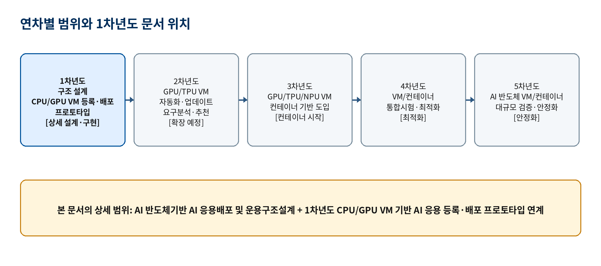
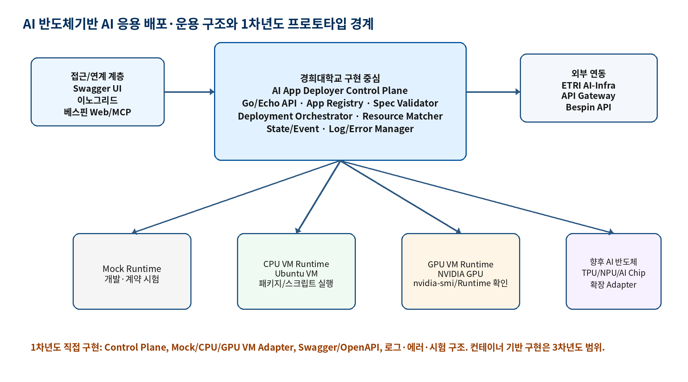
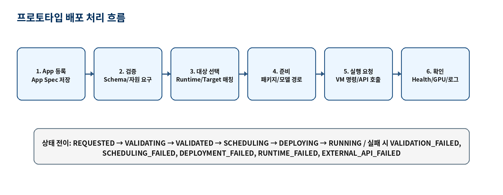
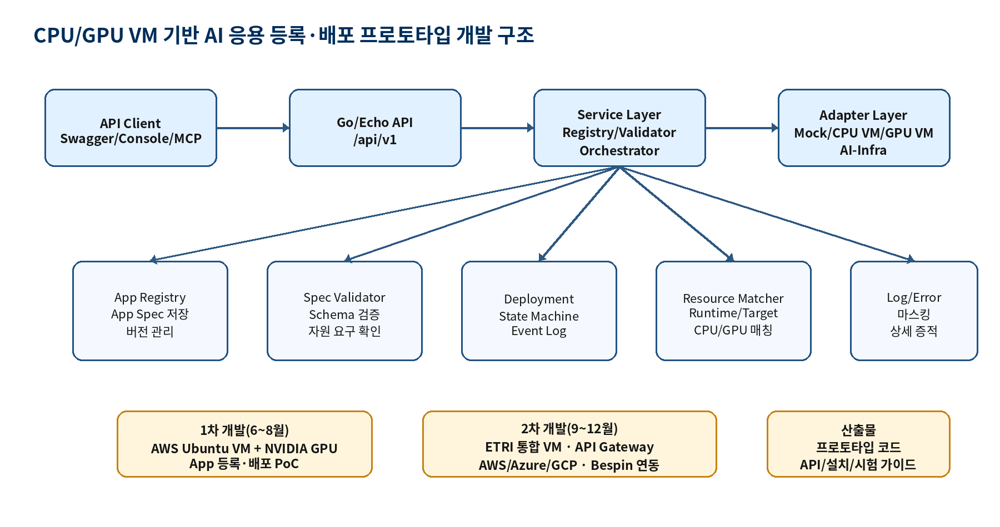
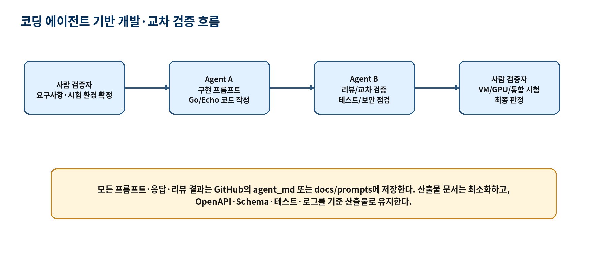

# AI 반도체 기반 AI 응용 배포 및 운용 구조 설계서

**경희대학교 담당 범위 / 최신본**

- 과제명: AI 반도체 기반 AI 모델·서비스 관리 및 운용 제어 자동화 기술 개발
- 문서명: AI 반도체 기반 AI 응용 배포 및 운용 구조 설계서
- 대상 세부과제: AI 반도체 기반 AI 모델 및 응용 관리 프레임워크
- 1차년도 직접 산출물: AI 응용 배포 및 운용 구조 설계서, CPU/GPU VM 기반 AI 응용 등록·배포 프로토타입
- 1차년도 구현 기준: Go 언어, Echo 프레임워크, Swagger/OpenAPI, GitHub, CPU/GPU VM, NVIDIA GPU VM, ETRI AI-Infra 연동 준비
- 범위 제외: LLM 운영관리 구조 설계서, 에이전트 등록관리 프로토타입, AI 응용 배포·제어 추론 최적화 전략 설계서, 컨테이너 기반 배포 구현

## 0. 문서 목적 및 범위

본 문서는 전체 과제 중 「AI 반도체 기반 AI 모델 및 응용 관리 프레임워크」의 세부 항목인 「AI 반도체 기반 AI 응용 배포 및 운용 구조 설계」를 정의한다. 문서의 목적은 AI 응용을 표준 명세로 등록하고, CPU/GPU VM 및 향후 AI 반도체 기반 실행 환경에 배포·운용하기 위한 구조, 절차, 자원 연계 방식, 프로토타입 구현 경계를 명확히 하는 것이다.

1차년도에는 실제 AI 반도체 VM 또는 컨테이너 환경을 전제로 구현하지 않는다. 1차년도 구현은 CPU/GPU VM 기반 AI 응용 등록·배포 프로토타입이며, NVIDIA GPU VM과 ETRI AI-Infra 연계 준비를 통해 향후 AI 반도체 Runtime 확장에 필요한 Control Plane, Runtime Adapter, Resource Matcher, 상태·로그·에러 체계를 검증한다.

| 구분 | 본 문서 반영 기준 |
| --- | --- |
| 작성 대상 | AI 반도체 기반 AI 응용 배포 및 운용 구조 설계 |
| 1차년도 구현 | CPU/GPU VM 기반 AI 응용 등록·배포 프로토타입 |
| 시스템명 | AI App Deployer |
| 경희대학교 담당 성격 | AI 응용 등록·배포·운용 Control Plane, 스케줄링/자원 매칭, AI-Ops 기반 로그·상태 관리 |
| 모델 처리 | 독립 모델 관리 시스템이 아니라 AI App 실행에 필요한 model_refs 또는 model_artifact 참조 정보로 제한 |
| 컨테이너 처리 | 1차년도 제외. GPU/TPU/NPU 컨테이너 기반 배포는 3차년도부터 도입 |
| 문서 관리 | 공식 설계서는 DOCX, 개발 실행 지시는 Markdown, API 계약은 Swagger/OpenAPI로 관리 |

## 0.1 현재 구현 기준선 및 제출 패키지 연결

2026-06-25 기준 프로토타입은 기능 추가보다 제출 가능한 산출물 패키지 정리를 우선한다. 현재 기준선은 Go/Echo API 서버, App Registry, Runtime/Target Profile, Deployment Orchestrator, CPU/GPU VM Runtime Adapter, Resource Check, Monitoring, Metric placeholder, ETRI AI-Infra mock/fixture skeleton을 포함한다.

| 구분 | 설계 요소 | 현재 구현 상태 | 제출 판단 |
| --- | --- | --- | --- |
| API 서버 | Go + Echo, `/api/v1`, request_id | 구현 완료 | 제출 가능 |
| OpenAPI/Swagger | API source of truth, HTML 문서 | 구현 완료 | 제출 가능 |
| App Registry | App Spec 등록, 조회, 중복 방지 | 구현 완료 | 제출 가능 |
| Artifact 정책 | package/git/binary/script 허용, container 거부 | 구현 완료 | 제출 가능 |
| Runtime Profile | mock, cpu_vm, gpu_vm, etri_aiinfra | 구현 완료 | 제출 가능 |
| Target Profile | CPU/GPU VM 대상 정보 등록 | 구현 완료 | 제출 가능 |
| Deployment Orchestrator | 상태 전이, 이벤트, 로그 | 구현 완료 | 제출 가능 |
| CPU VM Adapter | dry-run, SSH runner, file script upload | 구현 완료 | 제출 가능 |
| GPU VM Adapter | `nvidia-smi` readiness, dry-run, SSH runner | 구현 완료 | 제출 가능 |
| Resource Check | readiness, inventory snapshot | 구현 완료 | 제출 가능 |
| Monitoring | summary, runtime-health, alarms, metrics placeholder | 구현 완료 | 제출 가능 |
| ETRI AI-Infra | mock/fixture skeleton | 계약 전 준비 상태 | 실제 연동 제외 사유 명시 |
| Innogrid/Bespin | OpenAPI 호출 경계 문서화 | 실제 호출 미구현 | 계약 확정 후 구현 |

제출 패키지 정리는 `docs/release/1차년도_제출_패키지_체크리스트.md`, 시험 증적 기준은 `docs/evidence/증적_패키지_가이드.md`, 외부 연동 책임 경계는 `docs/external/외부_연동_경계_정리.md`를 따른다.

## 1. 과제 내 위치와 경희대학교 담당 범위

본 문서의 범위는 「AI 반도체 기반 AI 모델 및 응용 관리 프레임워크」에 한정한다. 「AI 기반 서비스 제어 및 관리 자동화 프레임워크」의 LLM 운영관리, 에이전트 등록관리, 자연어 지원 에이전트, 추론 최적화 전략은 별도 산출물로 관리한다. 다만 과제 개발 가이드에 따라 최소 2종 이상 LLM 코딩 에이전트를 개발 방법론으로 활용하고, 해당 프롬프트와 교차 검증 결과는 GitHub에서 관리한다.

| 전체 과제 항목 | 본 문서 포함 여부 | 처리 기준 |
| --- | --- | --- |
| AI 반도체 기반 AI 모델 및 응용 관리 프레임워크 | 포함 | AI 응용 배포/운용 구조와 CPU/GPU VM 기반 등록·배포 프로토타입을 다룬다. |
| AI 기반 서비스 제어 및 관리 자동화 프레임워크 | 제외 | LLM 운영관리, 에이전트 등록관리, 자연어 지원 에이전트는 별도 문서 범위이다. |
| AI 응용 자동화 에이전트 추론 최적화 | 제외 | AI 응용 배포·제어 추론 최적화 전략 설계서는 별도 산출물이다. |
| 코딩 에이전트 활용 개발 가이드 | 개발 방법으로 포함 | 구현 에이전트와 리뷰 에이전트를 분리하여 교차 검증한다. |

| 기관/주체 | 1차년도 연동 또는 담당 내용 | 본 설계서 처리 방식 |
| --- | --- | --- |
| 경희대학교 | LLM 기반 배포/운용 애플리케이션 개발 및 스케줄링 연구, AI-Ops 관점의 배포 제어 구조 | AI App Deployer Control Plane, Resource Matcher/Scheduler, 상태·로그·시험 구조로 반영 |
| ETRI | AWS GPU VM, 3종 CSP VM, 통합 시험 VM, AI-Infra, API Gateway 제공 또는 연동 | Target Profile, ETRI AI-Infra Adapter, Gateway Adapter로 연계 |
| 이노그리드 | App 등록/배포 흐름 공동 연동 | App 등록/배포 API 경계와 External Adapter로 연계 |
| 베스핀글로벌 | API, Web Console, MCP를 응용 배포 시스템과 연동 | Bespin API/Web/MCP Adapter와 Contract Test로 연계 |

## 2. 연차별 범위 구분

본 설계서는 1차년도 산출물이지만, 2~5차년도 확장 방향과 충돌하지 않도록 연차별 범위를 명확히 구분한다. 1차년도 설계에는 향후 확장 포인트를 남기되, 해당 기능을 1차년도 구현 범위로 오해할 수 있는 API·Schema·예제는 포함하지 않는다.



| 연차 | 공식 범위 | 본 설계서 반영 방식 |
| --- | --- | --- |
| 1차년도 | AI 반도체 기반 AI 응용 배포 및 운용 구조 설계, CPU/GPU VM 기반 AI 응용 등록·배포 프로토타입 | 현재 문서의 상세 범위. Go/Echo, Swagger, VM Runtime Adapter, CPU/GPU 자원 연계, 상태·로그·시험 기준을 정의한다. |
| 2차년도 | GPU/TPU VM 기반 AI 응용 배포 자동화/업데이트 기술, AI 응용 요구분석/추천 프로토타입 | 1차년도 구조가 자동화·업데이트·추천으로 확장될 수 있도록 Runtime Profile과 Deployment 상태 모델을 확장 가능하게 설계한다. |
| 3차년도 | GPU/TPU/NPU VM 기반 확장, GPU/TPU/NPU 컨테이너 기반 AI 응용 배포 자동화/업데이트 확장 | 컨테이너 기반 배포가 처음 도입되는 연차이다. 1차년도는 컨테이너를 제외하고 Adapter 확장 포인트만 유지한다. |
| 4차년도 | GPU/TPU/NPU VM 및 컨테이너 기반 배포 자동화/업데이트 통합시험 및 최적화 | 로그, 상태, 시험 증적 구조를 표준화하여 향후 통합시험과 최적화에 재사용한다. |
| 5차년도 | AI 반도체 VM/컨테이너 기반 대규모 AI 응용 배포/운용 검증 및 안정화, 50개 이상 AI 반도체 클라우드 검증시험 | Target Profile, Resource Inventory, 표준 로그 필드가 대규모 자원 검증으로 확장될 수 있도록 한다. |

## 3. 1차년도 개발 범위 및 산출물 관계

1차년도에는 구조 설계와 프로토타입 개발이 함께 수행된다. 본 설계서는 구조 설계의 기준 문서이며, CPU/GPU VM 기반 AI 응용 등록·배포 프로토타입 개발 문서는 구현 단위, API, 모듈, 일정, 시험 기준을 구체화하는 동반 산출물이다.

| 산출물 | 역할 | 형식 | 관계 |
| --- | --- | --- | --- |
| AI 응용 배포 및 운용 구조 설계서 | 전체 구조, 절차, 자원 연계, 연차별 확장성 정의 | DOCX | 본 문서 |
| CPU/GPU VM 기반 AI 응용 등록·배포 프로토타입 | 1차년도 구현 결과물 | Go 코드, GitHub | 본 문서의 구조를 구현으로 검증 |
| 프로토타입 개발설계서 | 구현 범위, 모듈, API, 시험, 에이전트 작업 단위 정의 | DOCX/MD | 본 문서의 1차년도 구현 부속 문서 |
| 기능/API 가이드 | API 사용법과 Swagger 기준 설명 | MD + Swagger | 프로토타입과 직접 연계 |
| 설치 활용 가이드 | VM 설치, 설정, 실행 절차 | MD | 기관별 독립 VM 및 통합 VM 시험에 사용 |
| 시험 가이드 | TC ID, 절차, 기대 결과, 로그 수집 방법 | MD | 1차/2차 통합 시험 증적 기준 |
| 에이전트 개발용 Markdown | 코딩 에이전트가 참조하는 역할별 작업 지시 | MD | 개발 프롬프트 및 교차 검증 기록 |

| 단계 | 기간 | 대상 환경 | 핵심 목표 | 수용 기준 |
| --- | --- | --- | --- | --- |
| 1차 개발·시험 | 6~8월 | AWS Ubuntu VM + NVIDIA GPU, 기관별 독립 VM | Go/Echo 개발환경, GitHub, Swagger, App 등록/배포 API, Mock Runtime, GPU VM PoC | App 등록 → 배포 요청 → 상태 조회 → 로그 조회 흐름이 독립 VM에서 재현된다. GPU 환경 확인 로그를 확보한다. |
| 2차 개발·통합 | 9~12월 | ETRI 통합 시험 VM, AWS·Azure·GCP Ubuntu VM + NVIDIA GPU, API Gateway, Bespin API/Web/MCP | ETRI AI-Infra 연동, API Gateway 설정, Bespin 연동, 3종 CSP Target Profile 등록·검증 | 프로토타입 수준 통합 시험이 가능하며 외부 API 실패·인증 실패·VM 접근 실패 로그가 표준 에러로 남는다. |

## 4. AI 응용 배포 구조 설계

AI 응용 배포 구조는 접근/연계 계층, Control Plane, Execution/Resource Plane, 외부기관 연동 계층으로 분리한다. 경희대학교 구현 중심 범위는 AI App Deployer Control Plane이며, 실제 GPU Runtime, AI-Infra 내부 실행, CSP 인프라 생성 자동화는 외부 실행 환경 또는 연계 시스템이 담당한다.



| 계층 | 구성요소 | 책임 |
| --- | --- | --- |
| 접근/연계 계층 | Swagger UI, API Client, 이노그리드 연동, 베스핀 Web Console/MCP | AI App 등록, 배포 요청, 상태 조회, 로그 조회 API를 호출한다. |
| Control Plane | Go/Echo API, App Registry, Spec Validator, Deployment Orchestrator, Resource Matcher, State/Event Manager, Log/Error Manager | AI 응용 배포·운용의 핵심 제어 기능을 담당한다. |
| Execution/Resource Plane | Mock Runtime, CPU VM, NVIDIA GPU VM, ETRI AI-Infra, 향후 AI 반도체 Runtime | 실제 AI App 실행, GPU Runtime 활용, 외부 AI-Infra API 수행을 담당한다. |
| 외부기관 연동 계층 | ETRI, 이노그리드, 베스핀글로벌 | VM 제공, AI-Infra, API Gateway, App 등록/배포 연동, Web Console/MCP 연계를 제공한다. |

| 구성요소 | 책임 | 1차년도 구현 기준 |
| --- | --- | --- |
| App Registry | AI App Spec, 버전, 모델 참조, 등록 이력 저장 | 파일 기반 또는 경량 DB 허용. Repository Interface를 유지한다. |
| Spec Validator | 실행 패키지, 실행 명령, Runtime 요구사항, 자원 요구사항, 모델 참조 검증 | JSON Schema와 Go Validator를 병행한다. |
| Deployment Orchestrator | 배포 요청 생성, 배포 계획 수립, 상태 전이, Adapter 호출 | Mock Runtime과 VM Runtime을 우선 구현한다. |
| Resource Matcher/Scheduler | App 요구사항과 Runtime/Target 자원을 매칭 | CPU, Memory, GPU, Storage, OS, Endpoint 조건을 검증한다. |
| Runtime Adapter | VM 또는 외부 AI-Infra 실행 요청 추상화 | 컨테이너가 아닌 VM 실행 명령 또는 외부 API 호출 중심으로 구현한다. |
| State/Event Manager | Deployment 상태와 이벤트 이력 관리 | 모든 상태 전이를 DeploymentEvent로 기록한다. |
| Log/Error Manager | 상세 로그, 외부 API 요약, 표준 에러 코드 관리 | 민감정보 마스킹과 디버깅 가능한 에러 메시지를 동시에 적용한다. |

## 5. AI 응용 운영 절차 및 정책 설계

운영 절차는 등록, 검증, 배포 요청, 배포 실행, 실행 확인, 모니터링, 중지/삭제, 장애 대응 순서로 정의한다. 1차년도는 상용 운영 자동화보다 프로토타입 시험 재현성과 로그 증적 확보를 우선한다.



| 절차 | 설명 | 정책 |
| --- | --- | --- |
| 등록 | AI App Spec을 등록한다. 모델은 App 실행에 필요한 참조 정보로 표현한다. | App 이름·버전 중복 검증, 실행 패키지 타입 검증, credential_ref 방식 적용 |
| 검증 | App Spec, Runtime Profile, Target Profile의 호환성을 확인한다. | GPU App은 GPU Target 또는 AI-Infra Target에서만 배포 가능하다. |
| 배포 요청 | App Version과 Target을 지정해 Deployment를 생성한다. | request_id와 deployment_id를 생성하고 REQUESTED 이벤트를 남긴다. |
| 배포 실행 | Runtime Adapter가 실행 패키지 준비와 실행 요청을 수행한다. | 1차년도는 VM 실행 명령 또는 외부 AI-Infra API 호출을 사용한다. |
| 실행 확인 | Healthcheck, 프로세스 상태, GPU Runtime 상태를 확인한다. | 성공 시 RUNNING, 실패 시 표준 실패 상태와 에러 코드를 기록한다. |
| 모니터링 | 상태, 로그, 에러, 리소스 점검 결과를 조회한다. | request_id, deployment_id, component, stage를 필수 로그 필드로 유지한다. |
| 중지/삭제 | 실행 중인 Deployment를 중지하거나 기록을 정리한다. | STOPPING→STOPPED 전이를 따른다. 삭제보다 이력 보존을 우선한다. |
| 장애 대응 | GPU 미탐지, VM 접근 실패, 외부 API Timeout, 인증 실패를 처리한다. | 표준 에러 코드와 원인 로그를 남기고 재시도 가능 여부를 표시한다. |

| 상태 | 의미 | 종료 상태 |
| --- | --- | --- |
| REQUESTED | 배포 요청 생성 | 아니오 |
| VALIDATING | App/Target 명세 검증 중 | 아니오 |
| VALIDATED | 명세 검증 완료 | 아니오 |
| SCHEDULING | Runtime/Target 매칭 및 배포 계획 생성 중 | 아니오 |
| DEPLOYING | 패키지 준비 또는 실행 요청 중 | 아니오 |
| RUNNING | AI App 실행 확인 완료 | 아니오 |
| STOPPING | 중지 요청 처리 중 | 아니오 |
| STOPPED | 정상 중지 완료 | 예 |
| VALIDATION_FAILED | 명세 검증 실패 | 예 |
| SCHEDULING_FAILED | 자원/대상 매칭 실패 | 예 |
| DEPLOYMENT_FAILED | 배포 실행 실패 | 예 |
| RUNTIME_FAILED | 실행 중 Runtime 장애 | 예 |
| EXTERNAL_API_FAILED | 외부 API 호출 실패 | 예 |
| UNKNOWN | 일시적 상태 확인 불가 | 아니오 |

## 6. 자원 연계 및 관리 구조 설계

자원 연계 구조는 App Spec의 자원 요구사항과 Target Profile의 실제 VM, GPU, 스토리지, 네트워크 정보를 매칭하는 방식으로 설계한다. 1차년도는 CSP 자원을 자동 생성하기보다 ETRI가 제공하는 VM을 등록·검증·활용하는 구조를 우선한다.

| 자원 | 관리 필드 | 확인 방법 |
| --- | --- | --- |
| CPU | core 수, architecture, 사용 가능 여부 | VM 메타데이터, OS 명령, 수동 등록값 |
| Memory | 총 메모리, 최소 요구량, 사용 가능 여부 | OS 명령 또는 수동 등록값 |
| GPU | vendor, model, count, driver_version, cuda_version, nvidia_smi 결과 | nvidia-smi, GPU Runtime Healthcheck |
| VM | CSP, region, host, OS, SSH/API endpoint, 운영 모드 | Target Profile 등록 및 readiness 확인 |
| Storage | artifact_dir, model_dir, log_dir, available_size, mount 상태 | 디렉터리 접근성, 쓰기 권한, 용량 확인 |
| Network | host, port, protocol, inbound/outbound 접근 가능성 | Healthcheck, API 호출, 포트 연결 확인 |
| 외부 API | base_url, auth type, timeout, retry, gateway path | readiness 및 Contract Test |

| Profile | 주요 목적 | 1차년도 예시 필드 |
| --- | --- | --- |
| App Spec | AI App 실행 조건과 자원 요구사항 정의 | artifact.type, entrypoint.command, runtime.type, resources.gpu, model_refs, healthcheck |
| Runtime Profile | 실행 Runtime의 능력과 Adapter 연결 방식 정의 | runtime_type=cpu/gpu/aiinfra/mock, accelerator=nvidia/none, operating_mode=vm_process/remote_api |
| Target Profile | 실제 배포 대상 VM/스토리지/네트워크 정의 | csp, vm.host, os, gpu.count, storage paths, credential_ref |
| Resource Inventory | 현재 자원 상태와 최근 점검 결과 기록 | gpu_available, disk_available, runtime_health, last_checked_at |

| 매칭 규칙 | 설명 |
| --- | --- |
| Runtime Type 일치 | App Spec의 runtime.type이 gpu이면 Runtime Profile과 Target Profile도 GPU 실행 가능해야 한다. |
| GPU 요구량 검증 | resources.gpu가 1 이상이면 Target의 gpu.count와 GPU Runtime Healthcheck가 성공해야 한다. |
| 스토리지 경로 검증 | Artifact, Model, Log 경로는 Target Profile에 정의되어야 하고 읽기/쓰기 권한을 확인해야 한다. |
| 네트워크 포트 검증 | App Spec의 app_port와 Target Profile의 service_port를 매핑하고 충돌 여부를 확인한다. |
| Credential 참조 | 접속 정보는 credential_ref로만 관리하고 실제 Secret은 별도 환경 설정에서 주입한다. |
| 컨테이너 제외 | 1차년도 Resource Matcher는 container runtime, image registry, Kubernetes node/pod capacity를 평가하지 않는다. |

## 7. CPU/GPU VM 기반 AI 응용 등록·배포 프로토타입 연계 설계

CPU/GPU VM 기반 AI 응용 등록·배포 프로토타입은 본 구조 설계서의 1차년도 구현 검증 수단이다. 따라서 구조 설계서에 정의된 App Spec, Runtime Profile, Target Profile, Deployment 상태, 로그·에러 코드가 프로토타입 개발 문서와 동일해야 한다.



| 프로토타입 기능 | 본 설계서 요구사항 | 개발 문서 상세화 항목 |
| --- | --- | --- |
| App 등록 | App Spec 등록, 버전 관리, 모델 참조 저장 | Handler, Service, Repository, Schema Validation |
| App 검증 | 실행 패키지, EntryPoint, Runtime, 자원 요구사항 검증 | Validator Rule, Error Code, Unit Test |
| Target 등록 | AWS/Azure/GCP 또는 ETRI 제공 VM 정보를 Target Profile로 관리 | Target Profile Schema, Readiness Check |
| 배포 요청 | App Version과 Target을 기준으로 Deployment 생성 | State Machine, Deployment Plan, Event Log |
| VM 배포 실행 | CPU/GPU VM에서 패키지/스크립트 기반 실행 | CPU VM Adapter, GPU VM Adapter, Credential Ref |
| 상태·로그 조회 | Deployment 상태와 단계별 로그 제공 | API Response, Log Query, Failure Test |
| 외부 연동 | ETRI AI-Infra, 이노그리드, 베스핀글로벌 연동 준비 | External Adapter, Contract Test, Gateway Config |

1차년도 프로토타입은 다음 구현을 우선한다.

| 우선순위 | 구현 항목 | 설명 |
| --- | --- | --- |
| 1 | Go/Echo API 서버 | /api/v1 기반 REST API, request_id, 공통 에러 응답 |
| 2 | App Registry/Spec Validator | App Spec 저장, 버전 관리, JSON Schema 검증 |
| 3 | Deployment Orchestrator | 배포 요청, 상태 전이, Event Log 기록 |
| 4 | Resource Matcher | Runtime Profile과 Target Profile 기반 CPU/GPU 자원 매칭 |
| 5 | Mock Runtime Adapter | 외부 VM/API 미제공 시 API 계약과 상태 흐름 검증 |
| 6 | CPU/GPU VM Runtime Adapter | Ubuntu VM 패키지/스크립트 실행, GPU readiness 확인 |
| 7 | External Adapter | ETRI AI-Infra, API Gateway, 이노그리드, 베스핀 API/Web/MCP 연동 준비 |
| 8 | 시험 및 가이드 | API/설치/시험 가이드, TC ID, 시험 로그, 프롬프트 기록 |

## 8. App Spec, API 및 데이터 모델 설계

1차년도 App Spec은 컨테이너 이미지가 아니라 VM에서 실행 가능한 패키지, Git 저장소, 스크립트 번들, 바이너리를 대상으로 한다. 모델 파일은 AI App 실행에 필요한 참조 정보로만 다루며, 별도 AI 모델 관리 시스템 구축은 본 문서의 범위가 아니다.

| 필드 | 필수 | 설명 |
| --- | --- | --- |
| schema_version | Y | appspec.khu.ai/v1alpha1 |
| kind | Y | AIApp |
| metadata.name | Y | App 이름 |
| metadata.version | Y | App 버전 |
| artifact.type | Y | package, git, binary, script 중 하나. container는 1차년도 제외 |
| artifact.uri | Y | 실행 패키지 또는 저장소 위치 |
| entrypoint.command | Y | VM에서 실행할 명령 |
| model_refs | N | 배포 시 사용할 모델 파일/경로/URI 참조 목록 |
| runtime.type | Y | cpu, gpu, aiinfra, mock 중 하나. semiconductor는 향후 확장 |
| resources | Y | CPU, Memory, GPU, Storage 요구사항 |
| network.ports | N | 서비스 포트. container_port 대신 app_port 사용 |
| healthcheck | N | HTTP 또는 command 기반 Healthcheck |

```yaml
schema_version: appspec.khu.ai/v1alpha1
kind: AIApp
metadata:
  name: sample-gpu-inference
  version: 0.1.0
artifact:
  type: package
  uri: s3://example-artifacts/sample-gpu-inference-0.1.0.tar.gz
entrypoint:
  command: ./run.sh
  args: ["--host=0.0.0.0", "--port=8080"]
runtime:
  type: gpu
  accelerator: nvidia
resources:
  cpu: "4"
  memory: 16Gi
  gpu: "1"
  storage: 20Gi
model_refs:
  - name: sample-model
    version: 0.1.0
    uri: s3://example-models/sample-model/
    mount_path: /opt/aiapp/models/sample-model
network:
  ports:
    - name: http
      app_port: 8080
      protocol: TCP
healthcheck:
  type: http
  path: /health
```

| Method | Endpoint | 설명 |
| --- | --- | --- |
| GET | /api/v1/healthz | 프로세스 생존 상태 확인 |
| GET | /api/v1/readiness | 저장소, Runtime, Target, 외부 API 준비 상태 확인 |
| POST | /api/v1/apps | AI App 등록 |
| GET | /api/v1/apps | AI App 목록 조회 |
| GET | /api/v1/apps/{app_id} | AI App 상세 조회 |
| POST | /api/v1/deployments | AI App 배포 요청 생성 |
| GET | /api/v1/deployments | Deployment 목록 조회 |
| GET | /api/v1/deployments/{deployment_id} | Deployment 상태 조회 |
| GET | /api/v1/deployments/{deployment_id}/logs | Deployment 로그 조회 |
| POST | /api/v1/deployments/{deployment_id}/stop | Deployment 중지 요청 |
| POST | /api/v1/runtime-profiles | Runtime Profile 등록 |
| POST | /api/v1/target-profiles | Target Profile 등록 |
| GET | /api/v1/resources/inventory | 자원 상태 조회 |
| POST | /api/v1/resources/check | 대상 자원 readiness 점검 |

## 9. Runtime Adapter 및 외부 연동 설계

Deployment Orchestrator는 구체 실행 환경을 직접 호출하지 않고 Runtime Adapter Interface를 통해 배포, 상태 조회, 로그 조회, 중지, 자원 점검을 수행한다. 이 방식은 Mock Runtime, CPU VM, GPU VM, ETRI AI-Infra, 향후 AI 반도체 Runtime을 동일한 제어 구조로 다룰 수 있게 한다.

| 메서드 | 역할 |
| --- | --- |
| ValidateTarget(ctx, target) | Target Profile의 접속성, OS, GPU, 스토리지, 네트워크 조건 검증 |
| HealthCheck(ctx, runtime, target) | Runtime과 대상 VM 또는 외부 API의 readiness 확인 |
| Prepare(ctx, app, target) | 실행 패키지와 모델 참조 경로를 대상 환경에 준비 |
| Deploy(ctx, app, runtime, target) | VM 실행 명령 또는 외부 AI-Infra API를 통해 실행 요청 |
| GetStatus(ctx, deploymentID) | 실행 상태 조회 |
| GetLogs(ctx, deploymentID, opt) | 배포·실행 로그 조회 |
| Stop(ctx, deploymentID) | 실행 중인 App 중지 요청 |

| Adapter | 1차년도 역할 | 처리 기준 |
| --- | --- | --- |
| Mock Runtime Adapter | 외부 VM/API 없이 상태 전이와 API 계약 검증 | 컨테이너 사용 없음 |
| CPU VM Adapter | Ubuntu VM에서 CPU 기반 실행 패키지 실행 | shell, systemd, process manager 등 VM 실행 방식 사용 |
| GPU VM Adapter | NVIDIA GPU VM에서 GPU Runtime 확인 후 App 실행 | nvidia-smi 및 GPU Runtime 체크. Docker/K8S 사용하지 않음 |
| ETRI AI-Infra Adapter | ETRI 제공 API를 통한 배포 요청·상태 조회·로그 조회 연동 | ETRI API 계약에 따르되 내부 표준 모델로 정규화 |
| Gateway Adapter | API Gateway 인증, 라우팅, Timeout, Retry 처리 | Gateway는 외부 API 연결 계층이며 컨테이너 오케스트레이션 계층이 아님 |

## 10. 로그·에러·보안 설계

1차년도 프로토타입은 통합 시험과 장애 분석을 위해 로그와 에러 메시지를 최대화해야 한다. 다만 API Key, Access Token, SSH Key, 비밀번호, 클라우드 Credential은 어떤 로그나 예시에도 노출하지 않는다.

| 필드 | 설명 |
| --- | --- |
| timestamp | ISO-8601 시간 |
| level | DEBUG, INFO, WARN, ERROR |
| request_id | API 요청 추적 ID |
| deployment_id | 배포 작업 ID |
| app_id / app_version_id | App 및 Version 식별자 |
| component | api, validator, orchestrator, runtime-adapter, resource-manager 등 |
| stage | VALIDATING, DEPLOYING, RUNNING 등 |
| runtime_profile_id | Runtime Profile 식별자 |
| target_profile_id | Target Profile 식별자 |
| external_api | 호출한 외부 API 이름 |
| elapsed_ms | 처리 시간 |
| error_code | 표준 에러 코드 |

| 에러 코드 | 설명 |
| --- | --- |
| APP_SPEC_INVALID | App Spec 필수 필드 또는 형식 오류 |
| APP_ARTIFACT_NOT_FOUND | 실행 패키지 또는 스크립트 위치 확인 실패 |
| ENTRYPOINT_INVALID | VM에서 실행할 명령 또는 작업 디렉터리 오류 |
| RUNTIME_PROFILE_INVALID | Runtime Profile 형식 또는 필수 필드 오류 |
| TARGET_PROFILE_INVALID | Target Profile 형식 또는 접속 정보 오류 |
| RESOURCE_INSUFFICIENT | CPU/Memory/GPU/Storage 요구량 충족 실패 |
| GPU_RUNTIME_NOT_FOUND | NVIDIA GPU 또는 GPU Runtime 확인 실패 |
| NVIDIA_DRIVER_NOT_FOUND | NVIDIA Driver 확인 실패 |
| CSP_VM_UNREACHABLE | 대상 VM 접근 실패 |
| STORAGE_PATH_UNAVAILABLE | Artifact/Model/Log 경로 접근 실패 |
| AI_INFRA_API_TIMEOUT | ETRI AI-Infra API 응답 지연 |
| AI_INFRA_API_FAILED | ETRI AI-Infra API 호출 실패 |
| GATEWAY_AUTH_FAILED | API Gateway 인증 실패 |
| BESPIN_API_FAILED | 베스핀 API 호출 실패 |
| DEPLOYMENT_FAILED | 배포 실행 실패 |
| RUNTIME_FAILED | 실행 중 Runtime 장애 |

## 11. 시험·수용 기준 및 통합 시험 계획

시험 설계는 1차년도 산출물의 완료 여부를 객관적으로 판단하기 위한 기준이다. 모든 시험은 TC ID를 부여하고, API 요청·응답, 로그 파일, VM/GPU 확인 결과, 실패 시 원인 로그를 함께 남긴다.

| TC ID | 시험 항목 | 수용 기준 |
| --- | --- | --- |
| TC-APP-001 | CPU App 등록 | App Spec 등록 성공 및 App ID 반환 |
| TC-APP-002 | GPU App 등록 | GPU 요구사항 포함 App Spec 등록 성공 |
| TC-VALID-001 | 잘못된 App Spec 검증 | APP_SPEC_INVALID 반환 |
| TC-RES-001 | GPU Target 자원 점검 | nvidia-smi 또는 GPU Runtime 확인 로그 확보 |
| TC-DEP-001 | Mock Runtime 배포 | REQUESTED → RUNNING 상태 전이 확인 |
| TC-DEP-002 | CPU VM 배포 | VM 실행 패키지 기반 실행 및 Healthcheck 확인 |
| TC-DEP-003 | GPU VM 배포 | GPU Runtime 확인 후 App 실행 또는 미제공 시 사유 기록 |
| TC-LOG-001 | Deployment 로그 조회 | request_id, deployment_id, stage 포함 로그 조회 |
| TC-EXT-001 | ETRI AI-Infra Contract | Mock/Fixture 또는 실 API 기준 요청/응답 검증 |
| TC-EXT-002 | Bespin/MCP 연동 Contract | 외부 호출 경로와 표준 응답 매핑 검증 |

## 12. 개발 가이드 및 산출물 관리 구조

개발은 Go 언어와 Echo 프레임워크를 기준으로 하며, API 정의는 Swagger/OpenAPI를 우선한다. 최소 2종 이상 LLM 코딩 에이전트를 활용하되, 이는 본 설계서의 기능 범위가 아니라 개발 방법론 및 검증 프로세스이다.



| 개발 가이드 | 적용 기준 |
| --- | --- |
| Go 언어 필수 | cmd/server/main.go와 internal 패키지 구조를 기준으로 Go/Echo 백엔드를 개발한다. |
| Swagger/OpenAPI 우선 | api/openapi.yaml을 기준 계약으로 두고 Handler, Schema, Test Fixture를 동기화한다. |
| 2종 이상 LLM 활용 | 구현 에이전트와 리뷰/교차검증 에이전트를 분리한다. |
| 프롬프트 중심 문서화 | 기능별 구현 프롬프트, 리뷰 프롬프트, 시험 프롬프트를 agent_md 또는 docs/prompts에 저장한다. |
| 문서 최소화 | DOCX 설계서 외에는 기능/API 가이드, 설치 활용 가이드, 시험 가이드를 Markdown 중심으로 관리한다. |
| 로그·에러 최대화 | 실패 원인 분석이 가능하도록 상세 로그를 남기되 민감정보는 마스킹한다. |
| 사람 검증 중심 | 사람은 실제 VM/GPU/외부 API 통합 시험과 최종 수용 판정을 담당한다. |
| GitHub 관리 | 코드, OpenAPI, Schema, 가이드, 프롬프트, 시험 로그를 GitHub 기준으로 관리한다. |

| 산출물 | 형식 | 관리 위치 |
| --- | --- | --- |
| AI 반도체 기반 AI 응용 배포 및 운용 구조 설계서 | DOCX | docs/ |
| CPU/GPU VM 기반 AI 응용 등록·배포 프로토타입 개발설계서 | DOCX/MD | docs/ |
| AI 응용 등록·배포 프로토타입 | Go 코드 | cmd/, internal/ |
| 요구사항 정의서 | DOCX | docs/requirements/ |
| 기능/API 가이드 | Markdown + Swagger | docs/api/, api/openapi.yaml |
| 설치 활용 가이드 | Markdown | docs/install/ |
| 시험 가이드 | Markdown | docs/test/ |
| 에이전트 개발 지시서 | Markdown | agent_md/ |
| 시험 로그 및 결과 | JSON/Markdown/Text | test/results/ 또는 release artifact |

## 13. 추적성 및 확정 필요사항

문서, OpenAPI, Schema, Go 코드, 테스트, agent_md 사이의 불일치를 줄이기 위해 추적성 매트릭스를 유지한다. 필드명, 상태값, 에러 코드는 한 곳에서 변경되면 관련 산출물을 함께 갱신해야 한다.

| 설계 항목 | 개발 산출물 | 검증 방법 |
| --- | --- | --- |
| AI 응용 배포 구조 | internal/deployment, internal/runtime, diagrams | E2E Test와 상태 전이 로그 |
| AI 응용 운영 절차 | state machine, event log, operations guide | 상태 전이 Unit Test와 Failure Test |
| 자원 연계/관리 | runtime_profile.schema.json, target_profile.schema.json, resource matcher | Resource Check API 및 GPU VM 시험 |
| App Spec | app_spec.schema.json, examples | Schema validation과 등록 API Test |
| API | openapi.yaml, Go handler | OpenAPI lint와 API Test |
| Runtime Adapter | internal/runtime/* | Mock/VM/Contract Test |
| 로그/에러/보안 | logger, errors, masking filter | Failure Test와 로그 검토 |
| 에이전트 활용 | agent_md/* | 프롬프트 기록과 교차 검증 결과 |

| 확정 필요사항 | 관련 기관 | 문서 반영 방식 |
| --- | --- | --- |
| ETRI 제공 AWS GPU VM 접속 정보와 GPU Runtime 방식 | ETRI | Target Profile, GPU VM Adapter, 설치 가이드 갱신 |
| ETRI AI-Infra API 상세 명세 | ETRI | ETRI AI-Infra Adapter와 Contract Test 갱신 |
| API Gateway 인증/라우팅 정책 | ETRI | Gateway Adapter와 readiness 항목 갱신 |
| App 등록/배포 책임 경계 | 이노그리드 | External Adapter와 API 가이드 갱신 |
| Bespin API/Web/MCP 호출 방식 | 베스핀글로벌 | Bespin Adapter와 MCP 연동 가이드 갱신 |

## 14. 외부 제공 인터페이스 설계

외부 제공 인터페이스는 이노그리드, 베스핀글로벌 Web Console/MCP-like 호출, ETRI 통합시험 환경, 운영자가 AI App Deployer를 호출하기 위한 REST/OpenAPI 계약이다. 본 인터페이스는 실제 외부 플랫폼 내부 API 구현이 아니라, 경희대학교가 제공하는 `/api/v1` 기반 등록·배포·상태·로그·모니터링 API의 공개 계약을 의미한다.

| 산출물 | 위치 | 역할 |
| --- | --- | --- |
| 외부 제공 인터페이스 명세서 | `docs/interface/KHU_AI_App_Deployer_외부제공인터페이스_명세서.md` | 외부 호출 범위, 요청·응답, 상태·에러, 책임 경계 정의 |
| 상태 및 에러 코드 정의 | `docs/interface/상태_에러코드_정의.md` | Deployment 상태값과 표준 error_code 정리 |
| 외부 연동 책임 경계 | `docs/interface/외부연동_책임경계.md` | ETRI/Innogrid/Bespin/API Gateway 책임 분리 |
| 인터페이스 예제 | `examples/interface/requests`, `examples/interface/responses` | 외부 연동 주체가 바로 호출 가능한 JSON 예제 |
| 인터페이스 smoke | `scripts/interface-smoke.ps1` | 외부 제공 예제로 API 호출 가능성 검증 |

1차년도에는 Docker/Kubernetes/Container API를 외부 제공 계약에 포함하지 않는다. 실제 ETRI/Innogrid/Bespin 내부 API는 계약 확정 후 `internal/external` client와 Runtime Adapter 교체 방식으로 연동한다.
