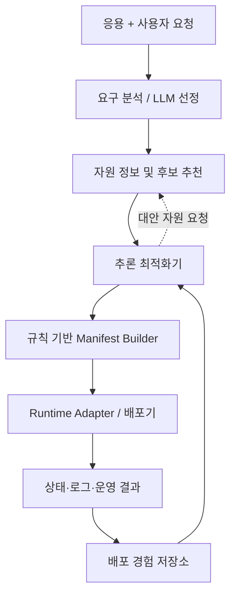

# AI-MCMP 경희대학교 개발 범위 및 추론 최적화기 개발안

> 문서 상태: 1차년도 개발을 위한 작업 기준 초안  
> 주의: 연구개발계획서와 ETRI 담당자 답변을 바탕으로 정리했으며, 기관 간 회의 결과에 따라 세부 역할과 인터페이스는 변경될 수 있다.

## 1. 결론

경희대학교가 개발할 **추론 최적화기**는 AI 모델의 생성 속도나 GPU 커널을 최적화하는 모듈이라기보다, **AI 응용의 배포·제어 에이전트가 더 적절한 판단을 내리도록 개선하는 모듈**로 정의하는 것이 현재 자료에 가장 부합한다.

즉 다음 판단을 개선하는 것이 핵심이다.

- 응용에 필요한 CPU·GPU·메모리·노드 수 등의 인프라 형상 결정
- 자원 추천 결과의 수용, 수정 또는 대안 재요청
- 배포 실행, 보류, 거절 및 사용자 추가 질의
- 배포 실패 원인에 따른 요구사항 조정과 재배포
- 과거 배포·운영 결과를 다음 판단에 다시 적용
- 향후 부하 변화에 따른 Scale-in/out 판단

따라서 1차년도 핵심 결과물은 별도 범용 스케줄러가 아니라 다음과 같은 **Inference Optimization Controller PoC**가 적절하다.

> 응용 요구사항, 자원 추천 결과, 과거 배포 이력 및 현재 상태를 입력받아 구조화된 `DeploymentDecision`을 생성하고, 검증·실행 결과를 이용해 재판단하는 제어기

## 2. 판단 근거

### 2.1 연구개발계획서에서 확인되는 방향

계획서에는 경희대학교 업무로 다음 내용이 포함되어 있다.

| 구분 | 계획서상 내용 | 개발 관점의 해석 |
|---|---|---|
| 1차년도 | CPU/GPU VM 기반 AI 응용 배포·제어에 특화된 추론 최적화 전략 설계 | 배포 판단 메커니즘과 검증 방법 설계 |
| 후속 연차 | GPU/TPU VM 기반 AI 응용 배포 정보 수집 및 추론 재적용 | 실행 결과를 다음 배포 판단에 피드백 |
| 후속 연차 | AI 응용 배포·제어에 특화된 추론 최적화 실행 | 설계한 판단 메커니즘의 실제 연동 |
| 최종 단계 | 추론 최적화 성능 향상 및 AI 응용 배포 시간 최적화 | 판단 정확성, 성공률, 복구 및 배포 시간 개선 |

관련 내용은 협약용 연구개발계획서의 인쇄 페이지 84, 88, 90, 94, 103 부근에서 확인된다.

한편 계획서에서는 다음 기능을 별도 항목으로 구분하고 있다.

- AI 응용 자체의 추론 성능·품질 측정: AI-App 모니터링 영역
- 비용에 특화된 추론 최적화: 비용 최적화 지원 에이전트 영역
- 응용 문맥이 없는 인프라 운용·배치 최적화: AI-Infra 영역

따라서 경희대학교의 핵심 범위를 **모델 서빙 엔진 최적화**로 보는 것보다는 **응용 문맥을 활용한 배포·제어 판단 최적화**로 보는 것이 자연스럽다.

### 2.2 ETRI 답변에서 확인된 개발 원칙

- 연구개발계획서의 큰 틀은 유지한다.
- 실제 개발은 킥오프 이후 정리된 R&R을 기준으로 추진한다.
- 경희대학교의 CPU/GPU VM 등록·배포 프로토타입은 1차년도 PoC로 유효하다.
- 다만 해당 배포기를 장기 운영용 프레임워크로 고도화하기보다는 알고리즘 실험·검증용 최소 구현으로 활용한다.
- AI-App 전체 프레임워크와 실제 배포 실행 기반은 이노그리드가 담당한다.
- 경희대학교는 추천·자동화·최적화 등 알고리즘과 메커니즘을 중심으로 개발한다.
- 별도 스케줄러 개발은 필수가 아니다.
- 다중 응용 빈패킹이나 VM 내부 프로세스 스케줄링은 선택적인 고도화 연구 영역이다.

## 3. 기관별 경계

| 주체 | 주 담당 범위 | 경희대학교와의 연결점 |
|---|---|---|
| 경희대학교 | 응용 요구 분석, 인프라 형상 추천, 배포·제어 판단 최적화, 피드백 재적용 | `ApplicationProfile`, `ResourceRecommendation`, `DeploymentDecision` 생성·활용 |
| 이노그리드 | AI-App 프레임워크, 응용 등록·버전·라이프사이클, 모니터링 정보 관리, 배포 실행 흐름 | 경희대 알고리즘을 느슨하게 결합된 모듈로 호출 |
| ETRI AI-Infra | 실제 인프라 가용성 확인, CSP·리전·세부 사양 결정, VM 생성 및 인프라 제어 | 추천 형상을 받아 실제 생성 가능한 인프라로 확정·회신 |
| 비용 최적화 기관 | 비용 중심 정책 및 비용 최적화 | 경희대는 예산을 제약조건이나 동률 해소 기준으로 활용 가능 |

경희대학교는 응용 특성을 바탕으로 대략적인 인프라 형상과 배포 행동을 결정하고, ETRI AI-Infra는 실제 가용성·위치·CSP 특성을 고려해 최종 인프라를 생성하는 구조를 기본안으로 한다.

## 4. 추론 최적화기의 최적화 대상

### 4.1 직접 최적화 대상

| 대상 | 설명 | 예시 지표 |
|---|---|---|
| 판단 적합성 | 응용 요구와 제약을 만족하는 행동을 선택했는가 | 정답 행동 일치율, 제약 위반률 |
| 배포 성공성 | 최초 배포 또는 재배포가 성공했는가 | First-deploy success rate |
| 실패 복구 | 오류에 맞는 대안과 재시도 전략을 선택했는가 | Recovery success rate, 평균 재시도 횟수 |
| 피드백 활용 | 같은 실패를 반복하지 않고 이력을 재적용하는가 | 동일 오류 재발률 |
| 배포 효율 | 의사결정부터 정상 구동까지 걸리는 시간을 줄였는가 | End-to-end deployment time |
| 판단 비용 | 불필요한 모델 호출과 긴 추론을 줄였는가 | 판단 지연, LLM 호출 수, 토큰 수 |

### 4.2 직접 개발 대상이 아닌 것

- LLM 추론 엔진의 배치 크기, KV cache, 양자화, Tensor Parallel 최적화
- ETRI 영역의 최종 CSP·리전 선택 및 실제 VM 생성
- 이노그리드의 전체 응용 등록·버전·라이프사이클 프레임워크
- 범용 Kubernetes 스케줄러의 재구현
- VM 내부 CPU affinity, GPU time slicing 및 프로세스 실행 순서 제어
- 하나의 VM에 여러 응용을 채우는 빈패킹 스케줄링

위 항목은 후속 연구로 확장할 수 있지만 1차년도 필수 범위로 두지 않는다.

## 5. 제안 통합 구조



핵심 원칙은 다음과 같다.

- LLM이 Raw Manifest를 직접 생성하지 않는다.
- 요구 분석 결과와 최적화 판단은 구조화된 JSON으로 전달한다.
- Manifest는 검증 가능한 규칙·템플릿 기반 Builder가 결정론적으로 생성한다.
- 추론 최적화기는 Manifest가 아니라 `DeploymentDecision`을 출력한다.
- 배포기는 결정 내용을 실행하고 결과만 반환한다.
- 실패 결과는 경험 저장소에 기록되어 다음 판단에 사용된다.

## 6. 추론 최적화기 내부 구조

| 모듈 | 역할 | 1차년도 구현 수준 |
|---|---|---|
| Context Builder | 요청, 응용 정보, 자원 후보, 관련 이력만 선택·정규화 | 필수 |
| Decision Planner | 현재 문맥에서 수행할 배포·제어 행동 생성 | 필수 |
| Tool Interface | 자원 재조회, 대안 후보 요청, 이력 검색 | 필수 |
| Constraint Verifier | 필수 자원, SLO, 정책 및 JSON Schema 검증 | 필수 |
| Repair Controller | 검증 실패나 배포 실패 시 수정·재판단 | 필수 |
| Experience Store | 판단 근거, 실행 결과, 실패 원인 및 성공 조건 저장 | 필수 |
| Learned Policy/RL | 축적 데이터로 정책을 학습 | 후속 선택 |

초기 구현은 복잡한 학습 모델보다 **규칙 + LLM + 결정론적 검증기**를 결합한 하이브리드 방식이 적절하다.

## 7. 입력과 출력

### 7.1 주요 입력

- `ApplicationProfile`: 응용 유형, 실행 방식, 아티팩트, 런타임, 필수 자원, SLO
- `ResourceRecommendation`: 실행 가능한 후보 형상과 추천 근거
- `ResourceSnapshot`: 현재 확인 가능한 CPU/GPU/메모리 및 상태
- `DeploymentHistory`: 과거 성공·실패 조건과 오류 정보
- `Policy`: 예산, 허용 리전, 보안, 재시도 횟수 등의 정책
- `DeploymentFeedback`: 배포 상태, 오류 코드, 로그 요약 및 관측값

### 7.2 주요 출력

`DeploymentDecision.action`은 최소한 다음 행동을 지원한다.

- `ACCEPT_RECOMMENDATION`: 추천 자원 형상을 채택하고 배포 진행
- `REQUEST_ALTERNATIVE_RESOURCE`: 현재 후보가 부적절하여 대안 요청
- `ADJUST_RESOURCE_REQUIREMENT`: CPU/GPU/메모리 등의 요구사항 조정
- `RETRY_DEPLOYMENT`: 동일 또는 수정된 조건으로 재시도
- `REQUEST_NEW_VM`: 필요한 형상의 신규 VM 요청
- `REJECT_DEPLOYMENT`: 정책 또는 필수 조건 위반으로 배포 거절
- `REQUEST_USER_CLARIFICATION`: 판단에 필요한 사용자 정보 추가 요청

## 8. 최소 JSON 계약 예시

### 8.1 최적화기 입력

```json
{
  "schema_version": "1.0",
  "request_id": "req-2026-001",
  "application_profile": {
    "application_id": "app-001",
    "artifact_type": "package",
    "runtime": "python3.11",
    "resource_requirements": {
      "cpu_cores_min": 4,
      "memory_gib_min": 16,
      "gpu_required": true,
      "gpu_memory_gib_min": 24
    },
    "slo": {
      "latency_ms_max": 1000
    }
  },
  "resource_recommendation": {
    "recommendation_id": "rec-001",
    "candidates": [
      {
        "candidate_id": "shape-gpu-24g",
        "cpu_cores": 8,
        "memory_gib": 32,
        "gpu_count": 1,
        "gpu_memory_gib": 24,
        "feasible": true
      }
    ]
  },
  "deployment_history": [
    {
      "result": "FAILED",
      "error_code": "GPU_OOM",
      "gpu_memory_gib": 16
    }
  ]
}
```

### 8.2 최적화기 출력

```json
{
  "schema_version": "1.0",
  "request_id": "req-2026-001",
  "decision_id": "dec-001",
  "action": "ACCEPT_RECOMMENDATION",
  "selected_candidate_id": "shape-gpu-24g",
  "adjusted_requirements": {
    "gpu_memory_gib_min": 24
  },
  "reason_codes": [
    "REQUIREMENTS_SATISFIED",
    "PREVIOUS_GPU_OOM_AVOIDED"
  ],
  "requires_manifest_generation": true,
  "retry_policy": {
    "max_attempts": 2
  }
}
```

공통 메시지는 `schema_version`, `request_id`, `timestamp`, `source`, `type`을 포함하고, 오류는 자유 텍스트보다 공통 `error_code`를 우선 사용한다.

## 9. 1차년도 우선 개발 항목

### P0 — 연차평가에 필요한 핵심 PoC

1. `ApplicationProfile`, `ResourceRecommendation`, `DeploymentDecision`, `DeploymentFeedback` JSON Schema 확정
2. 규칙 기반 기준선 Decision Planner 구현
3. 제약조건 및 출력 Schema 검증기 구현
4. Manifest Builder와의 인터페이스 연결
5. 배포 성공·실패 결과 저장 및 조회
6. 실패 유형별 재판단·재배포 루프 구현
7. 반복 가능한 실험 시나리오와 평가 코드 작성

### P1 — 연구성 강화

1. LLM 기반 Planner를 규칙 기반 기준선과 비교
2. 관련 이력만 선택하는 Context Builder 개발
3. 판단 근거를 `reason_codes`로 구조화
4. 과거 OOM, 자원 부족, 런타임 불일치에 대한 피드백 재적용
5. 판단 정확도, 배포 성공률, 복구율 및 배포 시간 비교 실험

### P2 — 후속 확장

- 부하 변화에 따른 Scale-in/out 판단
- 정책·SLO 변화에 따른 재배치 판단
- 다중 응용 자원 경합 및 빈패킹
- VM 내부 프로세스·GPU 실행 스케줄링
- 축적 데이터를 활용한 학습 기반 정책

## 10. 평가 시나리오

| 시나리오 | 기대 판단 | 검증 항목 |
|---|---|---|
| GPU 메모리 부족 이력 존재 | 더 큰 GPU 형상 선택 또는 대안 요청 | 동일 OOM 재발 방지 |
| 필수 CUDA 버전 불일치 | 후보 거절 및 호환 후보 요청 | 런타임 제약 준수 |
| 모든 후보가 메모리 최소치 미달 | 배포 강행 금지 | 제약 위반률 |
| 일시적 배포 실패 | 정책 범위 내 재시도 | 복구 성공률, 재시도 횟수 |
| 요구사항이 모호함 | 사용자 추가 질의 | 잘못된 추정 감소 |
| 추천 후보가 모든 조건 충족 | 추천 수용 후 Manifest 생성 요청 | 최초 배포 성공률 |

실험은 다음 단계로 비교하면 연구 결과를 설명하기 쉽다.

1. 규칙 기반 판단, 피드백 없음
2. 구조화된 Planner + 검증기
3. Planner + 검증기 + 배포 이력 기반 재추론

## 11. 현재 팀 분업에 맞춘 제안

| 담당 | 우선 업무 | 주요 산출물 |
|---|---|---|
| 건해·하은·민철 | 배포 에이전트 및 추론 최적화기 | Decision Planner, Verifier, Repair Controller, 피드백 루프 |
| 원익·종훈 | LLM 선정 및 응용 요구 분석 | `ApplicationProfile`, LLM 선정 결과, 요구사항 분석 인터페이스 |
| 경택·기범 | 모니터링·자원 정보 및 후보 추천 | `ResourceSnapshot`, `ResourceRecommendation`, 배포 후 관측 정보 |
| 민철의 기존 배포기 | 최소 PoC 유지 및 연동 어댑터화 | Manifest Builder, Runtime Adapter, Mock/실배포 교체 인터페이스 |

민철이 개발하던 배포기는 기능 확장보다 안정적인 실험 실행기와 어댑터로 유지하고, 신규 개발 역량은 추론 최적화기의 판단·검증·피드백 기능에 투입하는 것이 적절하다.

## 12. 팀 간 인터페이스 경계

| 송신 | 수신 | 메시지 | 책임 경계 |
|---|---|---|---|
| 요구 분석/LLM 선정 | 자원 추천 | `ApplicationProfile` | 응용 의미를 구조화하되 노드를 직접 선택하지 않음 |
| 자원 추천 | 추론 최적화기 | `ResourceRecommendation` | 실행 가능한 후보와 근거 제공 |
| 추론 최적화기 | Manifest Builder | `DeploymentDecision` | 행동과 선택 형상을 전달하되 Raw Manifest를 직접 작성하지 않음 |
| Manifest Builder | 배포기 | `DeploymentManifest` | 결정론적으로 생성·검증된 실행 명세 전달 |
| 배포기/모니터링 | 추론 최적화기 | `DeploymentFeedback` | 상태, 공통 오류 코드, 로그 요약 및 관측값 반환 |

## 13. 회의에서 최종 확인할 사항

1. 계획서의 ‘추론’이 배포·제어 에이전트의 판단을 의미한다는 해석에 대한 기관 간 합의
2. 경희대학교가 결정할 인프라 형상의 상세 수준
3. 이노그리드가 제공할 AI-App 인터페이스와 제공 시점
4. ETRI AI-Infra의 요청·응답 규격 및 최종 자원 결정 권한
5. 모니터링·배포 이력 중 경희대학교가 사용할 수 있는 필드
6. 1차년도 평가에서 요구되는 정량 지표와 실증 시나리오
7. Scale-in/out 판단의 착수 연차 및 실행 주체

## 14. 한 문장 정의

> 경희대학교의 추론 최적화기는 AI 응용의 요구사항과 자원 추천, 배포·운영 이력을 바탕으로 배포·제어 행동을 결정·검증하고, 실행 피드백을 재적용하여 판단 적합성·배포 성공률·복구율 및 배포 시간을 개선하는 에이전트 제어 모듈이다.
