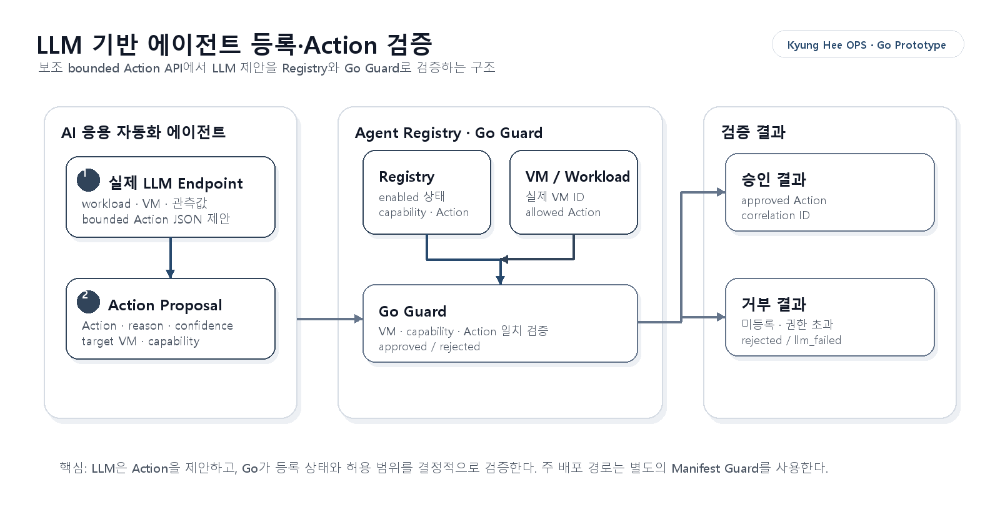

# 에이전트 등록 관리 프로토타입
English title: Agent Registration Management Prototype

## 1. 목적

본 프로토타입은 LLM 기반 AI 응용 자동화 에이전트의 Planner 역할, capability, 허용 Action과 실행 endpoint를 Go 기반 Agent Registry에서 관리합니다. Agent Dispatcher는 내장 Agent와 Runtime Agent를 같은 실행 계약으로 호출하며, 실행 전 Registry 권한 검증과 실행 후 결과 Guard를 모두 통과한 결과만 `ControlRun`에 확정합니다. LLM이 생성한 Deployment Manifest는 Go Manifest Guard를 통과한 경우에만 AppDeploy에 전달할 수 있습니다.



## 2. 핵심 구성

| 구성 | 역할 |
| --- | --- |
| `AIApplicationAutomationAgent` | 자연어 요구를 분석해 AppDeploy Deployment Manifest를 생성하는 LLM Planner |
| Agent Registry | 에이전트의 역할, capability, bounded Action과 사용 상태 관리 |
| Agent Dispatcher | Agent source에 따라 내장 Executor 또는 등록 Runtime endpoint를 선택해 한 번 실행 |
| Go Request/Result Guard | Registry capability와 bounded Action, 요청·응답 신원과 결과 경계를 결정론적으로 검사 |
| Go Manifest Guard | Manifest 계약, 자원 값, 요청 보존과 보안 경계를 승인 또는 거부 |
| AppDeploy | 승인된 Manifest를 받아 Target과 Adapter를 선택하고 배포 상태를 제공 |

VM 적합성 및 비용 증거 확인은 별도 AI 에이전트가 아니라 Go 검증 로직입니다. 외부 팀의 에이전트는 필요할 때 runtime registry에 추가할 수 있습니다.

## 3. 기본 에이전트

`config/agent_registry.json`에는 핵심 내부 에이전트 한 개를 정의합니다.

| 필드 | 값 |
| --- | --- |
| 이름 | `AIApplicationAutomationAgent` |
| capability | `ai_application_deployment_control`, `deployment_manifest_planning` |
| 핵심 bounded Actions | `generate_deployment_manifest`, `submit_deployment_manifest`, `observe_deployment_status` |
| 실행 방식 | 실제 LLM 생성 후 Go Guard 검증, AppDeploy API 연계 |

LLM provider와 실제 모델은 registry에 고정하지 않고 별도의 candidate config로 주입합니다. 따라서 Ollama, vLLM, OpenAI-compatible 연구 서버 등으로 교체할 수 있습니다.

## 4. 외부 실행 주체 등록

외부 실행 주체는 다음 계약으로 등록합니다.

| 필드 | 의미 |
| --- | --- |
| `name`, `version` | 실행 주체 식별 정보 |
| `endpoint`, `invocation_path` | 승인 후 전달할 대상 주소와 고정 경로 |
| `capabilities` | 제공 가능한 기능 |
| `bounded_actions` | 실제 처리 가능한 Action 목록 |
| `auth_token_env` | 선택적 Bearer token을 보관한 서버 환경 변수 이름 |
| `enabled` | 현재 선택 가능 여부 |

```json
{
  "name": "ExternalExecutionAgent",
  "version": "0.1.0",
  "role": "Execute validated AI application control requests.",
  "endpoint": "https://agent.example.com",
  "invocation_path": "/v1/actions",
  "auth_token_env": "EXTERNAL_AGENT_TOKEN",
  "capabilities": ["ai_application_deployment_control"],
  "bounded_actions": [
    "deploy_application",
    "observe_status",
    "restart_application",
    "stop_application"
  ]
}
```

Runtime 등록은 prototype 프로세스 메모리에 저장되며 서버 재시작 시 초기화됩니다. credential과 token 값은 registry payload에 저장하지 않습니다. Dispatcher는 등록된 endpoint와 invocation path를 결합한 주소에 JSON HTTP POST를 한 번 전송하며 redirect, timeout, 응답 크기와 JSON 형식을 제한합니다.

## 5. Planner 검증 흐름

```text
Agent Registry 선택·권한 확인
        ↓
Go Agent Request Guard
        ↓
Agent Dispatcher
   ├─ AIApplicationAutomationAgent
   │      → Qwen DeploymentManifest 생성
   │      → Go Manifest Guard
   └─ Runtime Agent endpoint
          → bounded HTTP POST 1건
          → Go Agent Result Guard
        ↓
모든 단계와 결과를 ControlRun에 기록
        ↓
Manifest 승인 시 선택적으로 AppDeploy 제출
```

`generation.execution_status=executed`는 LLM 호출과 Manifest 생성이 수행되었다는 뜻입니다. 실제 배포 완료 여부는 별도의 `deployment.status=RUNNING`으로 확인합니다.

## 6. CLI 검증

```bash
cd go/service-control-api

go run ./cmd/aiops-service-control list-agents \
  --registry ../../config/agent_registry.json

go run ./cmd/aiops-service-control validate-agent-action \
  --registry ../../config/agent_registry.json \
  --agent AIApplicationAutomationAgent \
  --action generate_deployment_manifest
```

실제 LLM Planner 연계는 실행 중인 OpenAI-compatible endpoint와 AppDeploy가 있을 때 다음 명령으로 검증합니다.

```bash
go run ./cmd/aiops-service-control run-appdeploy-planner \
  --request "GPU 추론 앱을 배포해 주세요." \
  --app-version-id appver-llm-inference-v1 \
  --candidates ../../config/ops_llm_eval_candidates.local_ollama.json \
  --candidate-id qwen3.5-ops-planner \
  --appdeploy-base-url http://127.0.0.1:8081/api/v1
```

## 7. API

| Method | Path | 기능 |
| --- | --- | --- |
| `GET`, `POST` | `/api/v1/agents` | 에이전트 조회 및 외부 실행 주체 등록 |
| `POST` | `/api/v1/agents/{name}/actions/{action}/validate` | bounded Action 검증 |
| `POST` | `/api/v1/agents/{name}/invocations/plan` | 비실행 호출 계획 생성 |
| `POST` | `/api/v1/agents/{name}/execute` | Registry·Dispatcher·Result Guard 기반 실제 Agent 실행 |
| `POST` | `/api/v1/automation/action-proposals` | 실제 LLM 제안과 Go Guard 검증 |
| `POST` | `/api/v1/automation/feedback` | 승인된 correlation ID의 실행 상태 기록 |
| `POST` | `/api/v1/planner/deployments` | Manifest 생성·Go Guard·AppDeploy 상태 추적 |

## 8. 현재 경계

- 완전 자율 multi-agent orchestration은 구현 범위가 아닙니다.
- 현재 실제 기능을 가진 내장 Agent는 `AIApplicationAutomationAgent` 한 개이며 Job Scheduling Agent는 포함하지 않습니다.
- 외부 Runtime Agent 실행은 요청 한 건당 등록 endpoint 호출 한 번으로 제한합니다.
- AppDeploy endpoint가 설정된 경우에만 실제 배포 요청을 호출합니다.
- 실제 LLM 실패, 잘못된 JSON, 허용 범위 밖 Action은 fallback 성공으로 바꾸지 않습니다.
- 운영용 인증 체계와 registry 영구 저장은 후속 통합 항목입니다.
