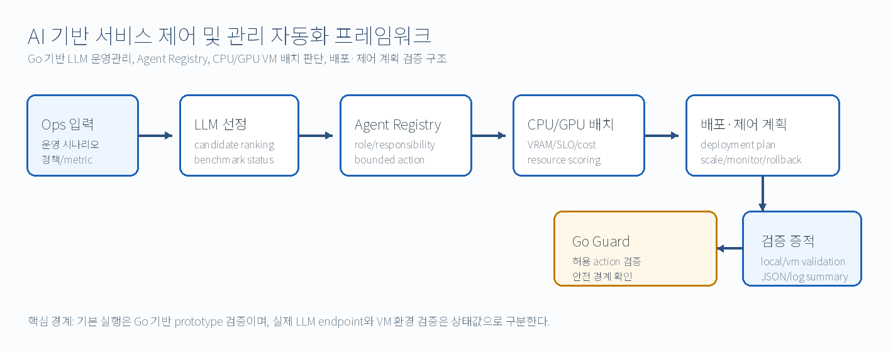

# 문서 지도

이 디렉터리는 1차년도 **AI 기반 서비스 제어 및 관리 자동화 프레임워크** 제출/시연 패키지의 문서 진입점입니다. 문서는 Go 기반 service-control prototype의 구현 범위, 공식 산출물, 실행 절차, 검증 증적을 연결합니다.

## 먼저 볼 문서

| 순서 | 문서 | 목적 |
| --- | --- | --- |
| 1 | [`../README.md`](../README.md) | 프로젝트 개요, 빠른 실행, 산출물 링크 |
| 2 | [`core_submission_summary.md`](core_submission_summary.md) | 1차년도 제출 범위와 연구 항목 매핑 |
| 3 | [`submission/requirements_definition.md`](submission/requirements_definition.md) | 요구사항 정의 |
| 4 | [`submission/install_and_run_guide.md`](submission/install_and_run_guide.md) | 로컬/VM 실행 절차 |
| 5 | [`submission/test_guide.md`](submission/test_guide.md) | Go test, team-validation, validate-system 검증 절차 |
| 6 | [`evidence/증적_패키지_가이드.md`](evidence/증적_패키지_가이드.md) | 제출 증적 구성 방식 |
| 7 | [`release/1차년도_제출_패키지_체크리스트.md`](release/1차년도_제출_패키지_체크리스트.md) | 제출 전 점검표 |

## 공식 설계 산출물

| 산출물 | Markdown 원본 | DOCX 변환본 |
| --- | --- | --- |
| LLM 운영 관리 구조 설계서 | [`deliverables/01_llm_operation_management_design.md`](deliverables/01_llm_operation_management_design.md) | [`deliverables/docx/01_LLM_Operation_Management_Design.docx`](deliverables/docx/01_LLM_Operation_Management_Design.docx) |
| 에이전트 등록 관리 프로토타입 | [`deliverables/02_agent_registration_management_prototype.md`](deliverables/02_agent_registration_management_prototype.md) | [`deliverables/docx/02_Agent_Registration_Management_Prototype.docx`](deliverables/docx/02_Agent_Registration_Management_Prototype.docx) |
| AI 응용 배포·제어 추론 최적화 전략 설계서 | [`deliverables/03_ai_application_deployment_control_optimization_strategy.md`](deliverables/03_ai_application_deployment_control_optimization_strategy.md) | [`deliverables/docx/03_AI_Application_Deployment_Control_Optimization_Strategy.docx`](deliverables/docx/03_AI_Application_Deployment_Control_Optimization_Strategy.docx) |

## 구현 및 API 문서

| 문서 | 설명 |
| --- | --- |
| [`submission/functional_api_guide.md`](submission/functional_api_guide.md) | HTTP API endpoint, request/response 구조 |
| [`submission/openapi_service_control.yaml`](submission/openapi_service_control.yaml) | OpenAPI/Swagger 계약 |
| [`submission/execution_code_guide.md`](submission/execution_code_guide.md) | 주요 Go 코드 위치와 실행 명령 |
| [`../go/service-control-api/README.md`](../go/service-control-api/README.md) | service-control API/CLI 모듈 설명 |
| [`../go/aiops-guard/README.md`](../go/aiops-guard/README.md) | bounded-action guard 모듈 설명 |

## 검증 및 평가 문서

| 문서 | 설명 |
| --- | --- |
| [`submission/ops_llm_benchmark_method.md`](submission/ops_llm_benchmark_method.md) | Ops LLM dry-run/executed benchmark 방식 |
| [`submission/evaluation_summary.md`](submission/evaluation_summary.md) | 기능 프로토타입 평가 범위 |
| [`submission/development_validation_log.md`](submission/development_validation_log.md) | 개발 검증 명령과 사람 검토 항목 |
| [`ops/로그_에러_가이드.md`](ops/로그_에러_가이드.md) | 상태값과 오류 메시지 해석 기준 |

## 예제 파일

| 경로 | 설명 |
| --- | --- |
| [`../examples/requests/`](../examples/requests/) | API 시연용 request JSON |
| [`../examples/responses/`](../examples/responses/) | API 시연용 response JSON |

## 그림 원본

| 경로 | 설명 |
| --- | --- |
| [`diagrams/`](diagrams/) | Mermaid diagram 원본 |
| [`images/`](images/) | Markdown과 DOCX 변환에 사용하는 PNG 구조도 및 수정용 SVG 구조도 |

## 문서 유지 규칙

- 구현 경로가 바뀌면 `README.md`, `docs/README.md`, `submission/execution_code_guide.md`를 함께 확인합니다.
- API endpoint가 바뀌면 `submission/openapi_service_control.yaml`, `submission/functional_api_guide.md`, `examples/`를 함께 확인합니다.
- 검증 명령이 바뀌면 `submission/test_guide.md`, `evidence/증적_패키지_가이드.md`, `release/1차년도_제출_패키지_체크리스트.md`를 함께 확인합니다.
- 실제 LLM benchmark 결과로 표현하려면 결과 파일에 `benchmark_status = executed`가 있어야 합니다.
