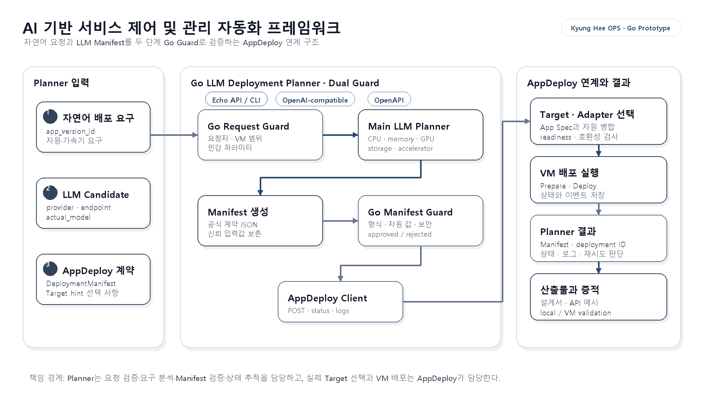

# 문서 지도

이 디렉터리는 1차년도 **AI 기반 서비스 제어 및 관리 자동화 프레임워크** 제출/시연 패키지의 문서 진입점입니다. 문서는 Go 기반 service-control prototype의 구현 범위, 공식 산출물, 실행 절차, 검증 증적을 연결합니다.

## 먼저 볼 문서

| 순서 | 문서 | 목적 |
| --- | --- | --- |
| 1 | [`../README.md`](../README.md) | 프로젝트 개요, 빠른 실행, 산출물 링크 |
| 2 | [`core_submission_summary.md`](core_submission_summary.md) | 1차년도 제출 범위와 연구 항목 매핑 |
| 3 | [`submission/requirements_definition.md`](submission/requirements_definition.md) | 요구사항 정의 |
| 4 | [`submission/install_and_run_guide.md`](submission/install_and_run_guide.md) | 로컬/VM 실행 절차 |
| 5 | [`submission/test_guide.md`](submission/test_guide.md) | Go test, team-validation, validate-system 검증 절차 |
| 6 | [`evidence/증적_패키지_가이드.md`](evidence/증적_패키지_가이드.md) | 제출 증적 구성 방식 |
| 7 | [`evidence/local_validation_20260703.md`](evidence/local_validation_20260703.md) | 2026-07-03 로컬 검증 결과 요약과 대표 JSON 산출물 |
| 8 | [`evidence/vm_validation_20260707.md`](evidence/vm_validation_20260707.md) | 2026-07-07 AWS GPU VM 검증 결과 |
| 9 | [`evidence/artifacts/local_20260707_ops_llm_evaluation_summary.json`](evidence/artifacts/local_20260707_ops_llm_evaluation_summary.json) | 2026-07-07 실제 LLM 평가 결과 |
| 10 | [`release/1차년도_제출_패키지_체크리스트.md`](release/1차년도_제출_패키지_체크리스트.md) | 제출 전 점검표 |

## 공식 설계 산출물

| 산출물 | Markdown 원본 | DOCX 변환본 |
| --- | --- | --- |
| LLM 운영 관리 구조 설계서 | [`deliverables/01_llm_operation_management_design.md`](deliverables/01_llm_operation_management_design.md) | [`deliverables/docx/01_LLM_Operation_Management_Design.docx`](deliverables/docx/01_LLM_Operation_Management_Design.docx) |
| 에이전트 등록 관리 프로토타입 | [`deliverables/02_agent_registration_management_prototype.md`](deliverables/02_agent_registration_management_prototype.md) | [`deliverables/docx/02_Agent_Registration_Management_Prototype.docx`](deliverables/docx/02_Agent_Registration_Management_Prototype.docx) |
| AI 응용 배포·제어 추론 최적화 전략 설계서 | [`deliverables/03_ai_application_deployment_control_optimization_strategy.md`](deliverables/03_ai_application_deployment_control_optimization_strategy.md) | [`deliverables/docx/03_AI_Application_Deployment_Control_Optimization_Strategy.docx`](deliverables/docx/03_AI_Application_Deployment_Control_Optimization_Strategy.docx) |

## 구현 및 API 문서

| 문서 | 설명 |
| --- | --- |
| [`submission/functional_api_guide.md`](submission/functional_api_guide.md) | HTTP API endpoint, request/response 구조 |
| [`submission/openapi_service_control.yaml`](submission/openapi_service_control.yaml) | OpenAPI/Swagger 계약 |
| [`submission/execution_code_guide.md`](submission/execution_code_guide.md) | 주요 Go 코드 위치와 실행 명령 |
| [`../go/service-control-api/README.md`](../go/service-control-api/README.md) | service-control API/CLI 모듈 설명 |
| [`../go/aiops-guard/README.md`](../go/aiops-guard/README.md) | bounded-action guard 모듈 설명 |
| [`llm-op/README.md`](llm-op/README.md) | LLM_Op prepare-only 자연어 Safeguard·Manifest Proposal 구현, 계약, 감사, demo 진입점 |
| [llm-op/07-manual-two-stage-browser-demo.md](llm-op/07-manual-two-stage-browser-demo.md) | 모델 API 없이 prompt 복사·raw JSON 붙여넣기로 진행하는 2단계 브라우저 시연 |
| [llm-op/08-operation-context-adapter-contract.md](llm-op/08-operation-context-adapter-contract.md) | 외부 서버 상태·로그 Adapter 입력 형식과 신뢰·freshness 경계 |

## 검증 및 평가 문서

| 문서 | 설명 |
| --- | --- |
| [`submission/ops_llm_benchmark_method.md`](submission/ops_llm_benchmark_method.md) | Ops LLM dry-run/executed benchmark 방식 |
| [`submission/evaluation_summary.md`](submission/evaluation_summary.md) | 기능 프로토타입 평가 범위 |
| [`submission/development_validation_log.md`](submission/development_validation_log.md) | 개발 검증 명령과 사람 검토 항목 |
| [`ops/로그_에러_가이드.md`](ops/로그_에러_가이드.md) | 상태값과 오류 메시지 해석 기준 |

## 통합 경계 문서

| 문서 | 설명 |
| --- | --- |
| [`design/main_llm_go_guard_control_flow.md`](design/main_llm_go_guard_control_flow.md) | 자연어 요구 분석, Deployment Manifest 생성, Go Guard와 AppDeploy 연계 흐름 |
| [`design/year1_vm_operation_scenarios.md`](design/year1_vm_operation_scenarios.md) | 1차년도 VM-only 통합 시나리오와 개별 동작 시나리오 초안 |
| [`design/llm_provider_abstraction.md`](design/llm_provider_abstraction.md) | OpenAI-compatible endpoint 기반 LLM provider 교체 구조 |
| [`design/integration_boundary.md`](design/integration_boundary.md) | LLM Planner, AppDeploy, 인프라 계층의 책임 경계 |
| [`llm-op/03-common-json-bridge.md`](llm-op/03-common-json-bridge.md) | geon Common JSON → LLM_Op bounded projection 계약 |
| [`coordination/to-geon-llm-op-handoff.md`](coordination/to-geon-llm-op-handoff.md) | geon 작업자와의 소유 범위·충돌 방지·release gate 합의안 |

## 예제 파일

| 경로 | 설명 |
| --- | --- |
| [`../examples/requests/`](../examples/requests/) | API 시연용 request JSON |
| [`../examples/responses/`](../examples/responses/) | API 시연용 response JSON |
| [`../examples/llm-op/`](../examples/llm-op/) | 4개 AI 서비스 metadata, offline fixture, 47개 정적 사용자 시나리오 |

## 그림 원본

| 경로 | 설명 |
| --- | --- |
| [`diagrams/generate_visual_assets.py`](diagrams/generate_visual_assets.py) | README와 산출물용 SVG/PNG 구조도 생성 스크립트 |
| [`diagrams/`](diagrams/) | Mermaid 기반 논리 흐름도와 그림 생성 스크립트 |
| [`images/`](images/) | Markdown과 DOCX 변환에 사용하는 고해상도 PNG 구조도 및 수정용 SVG 구조도 |

## 문서 유지 규칙

- 구현 경로가 바뀌면 `README.md`, `docs/README.md`, `submission/execution_code_guide.md`를 함께 확인합니다.
- API endpoint가 바뀌면 `submission/openapi_service_control.yaml`, `submission/functional_api_guide.md`, `examples/`를 함께 확인합니다.
- 검증 명령이 바뀌면 `submission/test_guide.md`, `evidence/증적_패키지_가이드.md`, `release/1차년도_제출_패키지_체크리스트.md`를 함께 확인합니다.
- 실제 LLM benchmark 결과로 표현하려면 결과 파일에 `benchmark_status = executed`가 있어야 합니다.
