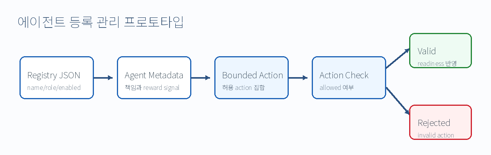

# 에이전트 등록 관리 프로토타입

영문 제목: Agent Registration Management Prototype

## 1. 설계 목적

본 문서는 AI 서비스 제어에 참여하는 agent를 등록하고, 각 agent의 역할과 허용 action을 검증하는 구조를 정의합니다. 목표는 LLM 또는 agent가 임의 action을 바로 실행하지 못하게 하고, 사전에 정의된 boundary 안에서만 서비스 제어 판단에 참여하도록 하는 것입니다.

## 2. 한눈에 보는 구조



| 항목 | 내용 |
| --- | --- |
| 입력 | `config/agent_registry.json` |
| 관리 대상 | agent name, role, responsibility, bounded action |
| 처리 | agent 조회, action 허용 여부 검증 |
| 출력 | agent list, agent detail, validation result |
| 연계 | service-operations readiness report |

## 3. Registry 데이터 구조

| 필드 | 의미 |
| --- | --- |
| `name` | agent 식별자 |
| `korean_name` | 한글 agent 이름 |
| `role` | agent 역할 |
| `responsibilities` | 책임 범위 |
| `bounded_actions` | 허용 action 목록 |
| `reward_signals` | 향후 평가 기준 |
| `enabled` | 사용 여부 |

## 4. 등록 Agent

| Agent | 역할 | 대표 action |
| --- | --- | --- |
| `AIServiceHASupportAgent` | 서비스 가용성과 recovery 필요성 검토 | `ha_scale_out_required`, `ha_no_action` |
| `AIApplicationManagementAgent` | AI 응용 배포·제어 검토 | `app_select_inference_vm`, `app_scale_deployment` |
| `AISemiconductorInfraOpsAgent` | CPU/GPU VM 제약 검증 | `infra_select_cpu_gpu_vm`, `infra_capacity_approved` |
| `CostOptimizationAgent` | 비용과 resource efficiency 검토 | `cost_budget_approved`, `cost_budget_rejected` |

## 5. Action 검증 규칙

| 단계 | 검증 내용 | 실패 시 처리 |
| --- | --- | --- |
| 1 | agent가 registry에 존재하는지 확인 | invalid |
| 2 | agent가 enabled 상태인지 확인 | invalid |
| 3 | 요청 action이 `bounded_actions`에 포함되는지 확인 | invalid |
| 4 | 승인 여부와 사유를 결과로 반환 | readiness 판단에 반영 |

## 6. Service-Control 연계

| 연계 지점 | 설명 |
| --- | --- |
| LLM 선정 이후 | 선택된 LLM이 제안하는 운영 판단을 agent boundary와 비교한다. |
| 배포 계획 생성 이후 | application/infrastructure/cost 관점에서 배포 계획을 검토한다. |
| readiness 판단 | agent review가 실패하면 통합 준비도 결과를 valid로 처리하지 않는다. |

## 7. 검증 방법

```bash
cd go/service-control-api
go run ./cmd/aiops-service-control list-agents \
  --registry ../../config/agent_registry.json

go run ./cmd/aiops-service-control validate-agent-action \
  --registry ../../config/agent_registry.json \
  --agent AIApplicationManagementAgent \
  --action app_scale_deployment
```

기대 신호:

```text
valid = true
```

## 8. 설계 경계

| 경계 | 설명 |
| --- | --- |
| Autonomy 경계 | 완전한 autonomous multi-agent orchestration이 아니다. |
| Safety 경계 | 허용 action 외 command는 ready 처리하지 않는다. |
| Reward 경계 | reward signal은 설계 기준이며 RL 학습 결과가 아니다. |
| 확장 경계 | 향후 runtime policy, 실제 metric, multi-agent planning과 연결할 수 있다. |
