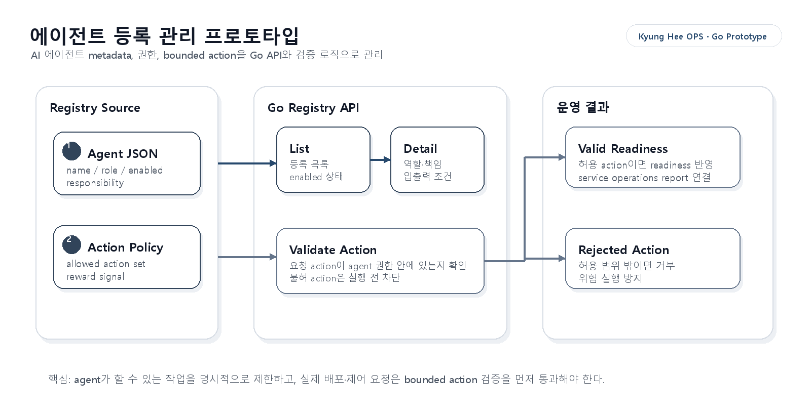

# 에이전트 등록 관리 프로토타입

영문 제목: Agent Registration Management Prototype

## 1. 설계 목적

본 문서는 AI 서비스 제어에 참여하는 agent를 등록하고, 각 agent의 역할과 허용 action을 검증하는 구조를 정의합니다. 설정 파일의 기본 agent와 외부 프레임워크의 agent를 동일한 조회·검증 경계에서 관리하며, 임의 action이 곧바로 실행되지 않도록 합니다.

## 2. 한눈에 보는 구조



| 항목 | 내용 |
| --- | --- |
| 입력 | `config/agent_registry.json`, 외부 agent 등록 요청 |
| 관리 대상 | agent name, endpoint, capability, bounded action |
| 처리 | agent 등록·조회, capability/action 허용 여부 검증 |
| 출력 | agent list, agent detail, action validation, invocation plan |
| 연계 | service-operations readiness report |

## 3. Registry 데이터 구조

| 필드 | 의미 |
| --- | --- |
| `name` | agent 식별자 |
| `korean_name` | 한글 agent 이름 |
| `role` | agent 역할 |
| `responsibilities` | 책임 범위 |
| `version` | 외부 agent 버전 |
| `endpoint` | 외부 agent 기본 endpoint |
| `invocation_path` | 검증된 호출 계획에 사용할 고정 경로 |
| `capabilities` | agent가 제공한다고 등록한 기능 |
| `bounded_actions` | 허용 action 목록 |
| `reward_signals` | 향후 평가 기준 |
| `enabled` | 사용 여부 |
| `source` | 설정 파일 또는 runtime 등록 구분 |

## 4. 등록 Agent

| Agent | 역할 | 대표 action |
| --- | --- | --- |
| `AIServiceHASupportAgent` | 서비스 가용성과 recovery 필요성 검토 | `ha_scale_out_required`, `ha_no_action` |
| `AIApplicationManagementAgent` | AI 응용 배포·제어 검토 | `app_select_inference_vm`, `app_scale_service_instances` |
| `AISemiconductorInfraOpsAgent` | CPU/GPU VM 제약 검증 | `infra_select_cpu_gpu_vm`, `infra_capacity_approved` |
| `CostOptimizationAgent` | 비용과 resource efficiency 검토 | `cost_budget_approved`, `cost_budget_rejected` |

외부 agent는 `POST /api/v1/agents`로 등록합니다. 등록 정보는 prototype 서버의 프로세스 메모리에만 유지되며 서버 재시작 시 초기화됩니다. 설정 파일의 기본 agent는 계속 유지됩니다.

## 5. Action 및 호출 계획 검증 규칙

| 단계 | 검증 내용 | 실패 시 처리 |
| --- | --- | --- |
| 1 | agent가 registry에 존재하는지 확인 | invalid |
| 2 | agent가 enabled 상태인지 확인 | invalid |
| 3 | 요청 capability가 `capabilities`에 포함되는지 확인 | invalid |
| 4 | 요청 action이 `bounded_actions`에 포함되는지 확인 | invalid |
| 5 | 검증된 endpoint와 action으로 호출 계획 생성 | `not_executed` 상태 반환 |

## 6. Service-Control 연계

| 연계 지점 | 설명 |
| --- | --- |
| LLM 선정 이후 | 선택된 LLM이 제안하는 운영 판단을 agent boundary와 비교한다. |
| 배포 계획 생성 이후 | application/infrastructure/cost 관점에서 배포 계획을 검토한다. |
| readiness 판단 | agent review가 실패하면 통합 준비도 결과를 valid로 처리하지 않는다. |
| 외부 agent 연계 | 등록된 capability와 bounded action을 검증한 뒤 호출 대상 계획을 생성한다. |

## 7. 검증 방법

```bash
cd go/service-control-api
go run ./cmd/aiops-service-control list-agents \
  --registry ../../config/agent_registry.json

go run ./cmd/aiops-service-control validate-agent-action \
  --registry ../../config/agent_registry.json \
  --agent AIApplicationManagementAgent \
  --action app_scale_service_instances
```

기대 신호:

```text
valid = true
```

API 기반 외부 agent 등록과 호출 계획 생성 예시는 다음과 같습니다.

```bash
curl -X POST http://127.0.0.1:8080/api/v1/agents \
  -H 'content-type: application/json' \
  -d '{
    "name":"ExternalDeploymentAdvisor",
    "version":"0.1.0",
    "role":"Review AI application deployment plans.",
    "endpoint":"https://agent.example.com",
    "invocation_path":"/v1/actions",
    "capabilities":["deployment_review"],
    "bounded_actions":["review_deployment_plan"]
  }'

curl -X POST http://127.0.0.1:8080/api/v1/agents/ExternalDeploymentAdvisor/invocations/plan \
  -H 'content-type: application/json' \
  -d '{"capability":"deployment_review","action":"review_deployment_plan"}'
```

## 8. 설계 경계

| 경계 | 설명 |
| --- | --- |
| Autonomy 경계 | 완전한 autonomous multi-agent orchestration이 아니다. |
| Safety 경계 | 허용 action 외 command는 ready 처리하지 않는다. |
| 실행 경계 | invocation plan은 외부 HTTP 요청을 실행하지 않으며 `not_executed`로 반환한다. |
| 저장 경계 | runtime 등록은 프로세스 메모리 기반이며 영구 저장이 아니다. |
| Reward 경계 | reward signal은 설계 기준이며 RL 학습 결과가 아니다. |
| 확장 경계 | 향후 인증, 영구 저장, health check, 실제 metric, 승인된 dispatcher와 연결할 수 있다. |
