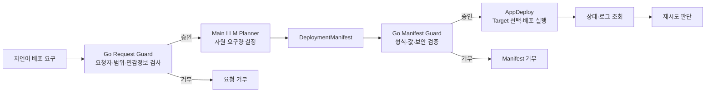

# LLM Deployment Planner와 이중 Go Guard 연계 흐름

## 1. 역할

이 저장소의 핵심 역할은 **AppDeploy 앞단의 LLM Deployment Planner**입니다. Go Request Guard가 사용자의 자연어 배포 요구를 먼저 검사하고, 승인된 요구만 LLM에 전달합니다. LLM은 CPU, 메모리, GPU, 디스크, accelerator 요구량을 결정해 AppDeploy 공식 `DeploymentManifest`를 생성하며, Go Manifest Guard가 생성 결과를 다시 검사합니다.

플래너는 실제 VM이나 Runtime Adapter를 선택하지 않습니다. App Spec 조회, Target 선택, readiness 검사, artifact 준비, VM 배포와 이벤트 저장은 AppDeploy가 담당합니다.

## 2. 전체 흐름



실제 API 흐름은 다음과 같습니다.

```text
POST /api/v1/planner/deployments
  -> Go Request Guard 검증
  -> 실제 LLM endpoint 호출
  -> DeploymentManifest JSON 생성
  -> Go Manifest Guard 검증
  -> AppDeploy POST /api/v1/deployments
  -> GET /api/v1/deployments/{deployment_id}
  -> GET /api/v1/deployments/{deployment_id}/logs
```

## 3. 플래너 입력

| 필드 | 의미 |
| --- | --- |
| `natural_language_request` | 사용자의 배포 요구 |
| `app_version_id` | AppDeploy에 등록된 App Version 식별자 |
| `candidate_id` | 호출할 실제 LLM 후보 |
| `target_profile_id` | 선택적 Target hint. 최종 선택 권한은 AppDeploy에 있음 |
| `parameters` | 앱 실행에 필요한 비밀정보가 아닌 추가 파라미터 |

## 4. Go Request Guard

LLM 호출 전에 다음 항목을 결정적으로 검사합니다.

| 검증 | 기준 |
| --- | --- |
| 필수 입력 | 자연어 요구, App Version, LLM candidate가 존재하는지 확인 |
| 요청 길이 | 정책의 최대 길이를 초과하는 요청 거부 |
| 요청자 | `config/planner_guard_policy.json`의 allowlist 확인 |
| 1차년도 범위 | Kubernetes, 컨테이너, shell 실행 등 VM 범위 밖 요청 거부 |
| 민감정보 | password, token, credential, API key와 유사한 parameter key 거부 |

거부 시 `REQUEST_REJECTED`와 검사 결과를 반환하며 LLM과 AppDeploy를 호출하지 않습니다. 현재 `requested_by`는 인증 토큰에서 도출한 신원이 아니라 프로토타입 caller ID이므로, 운영 통합 단계에서는 인증 계층의 principal로 대체해야 합니다.

예시:

```json
{
  "natural_language_request": "GPU 1개, CPU 4개, 메모리 16Gi가 필요한 추론 앱을 배포해 주세요.",
  "app_version_id": "appver-llm-inference-v1",
  "candidate_id": "qwen3.5-ops-planner"
}
```

## 5. LLM이 생성하는 Manifest

```json
{
  "schema_version": "deployment.khu.ai/v1alpha1",
  "kind": "DeploymentManifest",
  "metadata": {"name": "llm-inference"},
  "spec": {
    "app_version_id": "appver-llm-inference-v1",
    "accelerator": "nvidia",
    "resources": {
      "cpu": "4",
      "memory": "16Gi",
      "gpu": "1",
      "storage": "20Gi"
    },
    "requested_by": "ai-ops-geon-planner"
  }
}
```

LLM은 VM ID, Runtime Adapter, credential, shell command, 컨테이너 또는 Kubernetes 리소스를 만들지 않습니다. `target_profile_id`가 없으면 AppDeploy가 등록된 Target 중 준비 상태와 자원 요구를 만족하는 대상을 선택합니다.

## 6. Go Manifest Guard 검증

| 검증 | 기준 |
| --- | --- |
| 계약 | `schema_version`, `kind`, JSON 필드 형식 확인 |
| 요청 보존 | LLM이 `app_version_id`와 Target hint를 바꾸지 않았는지 확인 |
| 자원 값 | CPU/GPU 정수, memory/storage 단위, accelerator 조합 확인 |
| 비밀정보 | password, token, credential, API key와 유사한 parameter 거부 |
| 출력 제한 | 알 수 없는 JSON 필드와 복수 JSON 객체 거부 |

검증 실패 시 AppDeploy를 호출하지 않으며 `MANIFEST_REJECTED`로 종료합니다. LLM 호출 실패도 규칙 기반 가짜 Manifest로 대체하지 않습니다.

## 7. AppDeploy 연계

Go Manifest Guard를 통과한 Manifest는 AppDeploy의 다음 공식 API에 전달됩니다.

| 단계 | AppDeploy API |
| --- | --- |
| 배포 요청 | `POST /api/v1/deployments` |
| 상태 조회 | `GET /api/v1/deployments/{deployment_id}` |
| 로그 조회 | `GET /api/v1/deployments/{deployment_id}/logs` |

플래너는 `REQUESTED -> VALIDATING -> VALIDATED -> SCHEDULING -> DEPLOYING -> RUNNING` 상태를 제한된 횟수로 조회합니다. 실패 상태도 그대로 반환합니다.

## 8. 재시도 원칙

- 상태 조회는 설정된 횟수와 간격 안에서만 반복합니다.
- AppDeploy `ErrorResponse.retryable=true`가 명시된 경우에만 재시도 가능성을 표시합니다.
- 실패 상태 이름만 보고 임의로 재배포하지 않습니다.
- 동일 배포의 중복 생성을 피하기 위해 `POST /deployments`를 자동 재전송하지 않습니다.

## 9. 책임 경계

| 구성요소 | 책임 |
| --- | --- |
| Go Request Guard | LLM 호출 전 요청자, 허용 범위, 민감정보 검사 |
| LLM Deployment Planner | 자연어 요구 분석, 자원 요구량 결정, Manifest 생성, 상태 polling, 재시도 판단 |
| Go Manifest Guard | LLM 생성 Manifest 계약과 정책의 결정적 검증 |
| AppDeploy | App Spec 조회, Target/Adapter 선택, readiness, artifact, VM 배포, 상태·이벤트 저장 |
| 인프라 계층 | 실제 CPU/GPU VM 제공과 수명주기 관리 |

이 구분에 따라 본 프로젝트는 상위 판단·검증·연계 프레임워크이고, AppDeploy는 실제 배포 실행 계층입니다.
