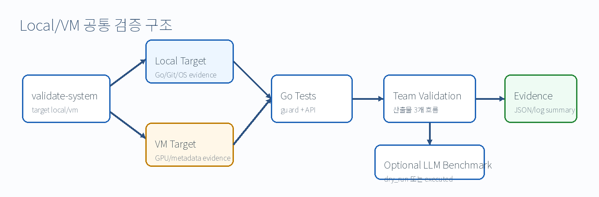

# 증적 패키지 가이드

## 1. 목적

이 문서는 Go 기반 service-control prototype을 제출 또는 시연할 때 어떤 실행 결과를 증적으로 보존해야 하는지 정의합니다. 증적은 “구현했다”는 설명이 아니라, 같은 명령을 실행했을 때 어떤 결과 파일이 생성되고 어떤 연구 항목을 검증하는지 보여주는 자료입니다.



## 2. 증적 구성 원칙

| 원칙 | 설명 |
| --- | --- |
| 명령 보존 | 실행한 command를 그대로 기록합니다. |
| 환경 보존 | OS, Go version, Git branch, Git commit을 함께 기록합니다. |
| 결과 보존 | JSON, stdout/stderr, summary 파일을 날짜가 포함된 directory에 저장합니다. |
| 상태 구분 | `not_executed`, `dry_run`, `executed`를 섞어 표현하지 않습니다. |
| 실패 보존 | 실패도 증적입니다. endpoint 미실행, GPU 미탐지, quota 제한은 원인과 함께 남깁니다. |

## 3. 기본 증적 목록

| 증적 | 생성 명령 | 검증 의미 |
| --- | --- | --- |
| Go guard test | `cd go/aiops-guard && go test ./...` | bounded-action guard 구현 검증 |
| Service-control test | `cd go/service-control-api && go test ./...` | API/CLI/service logic 검증 |
| Team validation | `go run ./cmd/aiops-service-control team-validation --output-dir ../../runs/my-first-validation` | 산출물 3개 흐름의 통합 검증 |
| Local system validation | `go run ./cmd/aiops-service-control validate-system --target local --output-dir ../../runs/full-validation-local` | 로컬 환경 공통 검증 |
| VM system validation | `go run ./cmd/aiops-service-control validate-system --target vm --output-dir ../../runs/full-validation-vm` | VM 내부의 Go/GPU/metadata 검증 |
| Ops LLM dry-run | `run-ops-llm-benchmark --dry-run` | 평가 파이프라인 연결 검증 |
| Ops LLM executed | `run-ops-llm-benchmark` | 실제 OpenAI-compatible endpoint 응답 평가 |

## 4. Team Validation 결과 파일

| 파일 | 검증 항목 |
| --- | --- |
| `00_team_validation_summary.json` | 전체 validation step 요약 |
| `01_select_ops_llm.json` | Ops 분석 시험 및 최적 LLM 선정 흐름 |
| `02_list_agents.json` | 에이전트 등록 목록 |
| `03_validate_agent_action.json` | 에이전트 bounded action 검증 |
| `04_recommend_inference_placement.json` | CPU/GPU VM 기반 배치 판단 |
| `05_plan_inference_deployment.json` | AI 응용 배포·제어 계획 |
| `06_run_service_operations.json` | LLM, agent, placement, guard 통합 실행 결과 |

## 5. System Validation 결과 파일

| 파일 | local | vm | 의미 |
| --- | --- | --- | --- |
| `00_system_validation_summary.json` | 필수 | 필수 | 전체 검증 summary |
| `01_environment.json` | 필수 | 필수 | hostname, user, OS, Go version, Git 정보 |
| `02_go_test_aiops_guard.txt` | 필수 | 필수 | guard test stdout/stderr |
| `03_go_test_service_control_api.txt` | 필수 | 필수 | service-control test stdout/stderr |
| `team-validation/` | 필수 | 필수 | 통합 기능 검증 JSON |
| `ops-llm-benchmark/` | 선택 | 선택 | `--run-llm-benchmark` 사용 시 생성 |
| `04_vm_nvidia_smi.txt` | 없음 | 필수 | GPU driver/CUDA visibility |
| `05_vm_aws_metadata.json` | 없음 | 필수 | VM metadata evidence |

## 6. 상태값 해석

| 상태 | 증적 해석 |
| --- | --- |
| `not_executed` | 실제 LLM provider 호출이 수행되지 않았습니다. 기본 정책 baseline 또는 endpoint 미준비 상태입니다. |
| `dry_run` | 실제 LLM API 호출 없이 scenario/candidate/evaluator wiring만 검증했습니다. |
| `executed` | 실제 OpenAI-compatible endpoint가 응답했고 evaluator가 결과를 점수화했습니다. |

## 7. 제출 시 권장 폴더명

```text
runs/
  full-validation-local-YYYYMMDD-HHMM/
  full-validation-vm-YYYYMMDD-HHMM/
  ops-llm-evaluation-dry-run-YYYYMMDD-HHMM/
  ops-llm-evaluation-executed-YYYYMMDD-HHMM/
```

`runs/`는 로컬 증적 디렉터리이며 기본적으로 Git 추적 대상이 아닙니다. 제출 시에는 필요한 결과만 별도 압축하거나 캡처 자료로 정리합니다.

## 8. 사람 검토 체크

- `git commit` 값이 제출 코드와 일치하는지 확인합니다.
- `valid = true` 결과와 실패 결과를 구분해 보존합니다.
- LLM 실행 결과가 실제 평가라고 주장되는 경우 `benchmark_status = executed`인지 확인합니다.
- VM 검증 결과라고 주장되는 경우 `--target vm`으로 VM 내부에서 실행되었는지 확인합니다.
- GPU 검증 결과라고 주장되는 경우 `nvidia-smi` 또는 동등한 GPU visibility 증거가 있는지 확인합니다.
